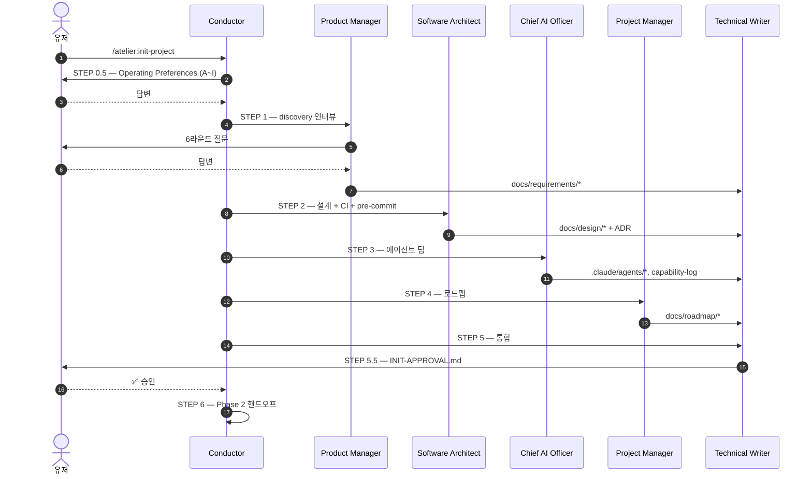
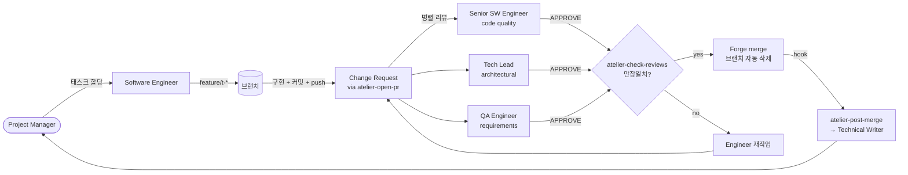

<p align="center">
  
</p>

<p align="center">
  <em>Claude Code용 범용 멀티에이전트 프로젝트 하네스.<br/>
  웹·데이터·ML·핀테크·CLI — 어떤 프로젝트든 구조화된 AI 팀과 엄격한 거버넌스로 발견부터 릴리스까지 운영합니다.</em>
</p>

<p align="center">
  <a href="LICENSE"></a>
  <a href="meta/ROADMAP.md"></a>
  <a href="meta/ROADMAP.md"></a>
</p>

<p align="center">
  
</p>

<p align="center">🇺🇸 <a href="README.md">English version</a></p>

---

## 목차

- [atelier란?](#atelier란)
- [왜 atelier인가?](#왜-atelier인가)
- [빠른 시작](#빠른-시작)
- [핵심 개념](#핵심-개념)
- [9개 기본 에이전트](#9개-기본-에이전트)
- [Phase 1 흐름 (초기화)](#phase-1-흐름-초기화)
- [Phase 2 흐름 (실행)](#phase-2-흐름-실행)
- [하드 강제 게이트](#하드-강제-게이트)
- [유저 스킬 (슬래시 명령)](#유저-스킬-슬래시-명령)
- [설정 — Operating Preferences](#설정--operating-preferences)
- [커스터마이징·확장](#커스터마이징확장)
- [Forge 지원](#forge-지원)
- [문서 트리](#문서-트리)
- [자체 검증](#자체-검증)
- [FAQ](#faq)
- [트러블슈팅](#트러블슈팅)
- [기여하기](#기여하기)
- [로드맵](#로드맵)
- [버저닝](#버저닝)
- [라이선스 및 고지사항](#라이선스-및-고지사항)
- [감사의 말](#감사의-말)

---

## atelier란?

`atelier`는 프로젝트 실행을 **구조화된 멀티에이전트 워크플로우**로 바꿔주는 Claude Code 플러그인입니다. "앱 만들어줘"라고 한 명의 Claude에게 부탁하는 대신:

- **Phase 1 전문가 5명**이 인터뷰하고, 시스템을 설계하고, 프로젝트 전용 AI 팀을 구성하고, 로드맵을 짜고, 문서를 통합한 뒤 — **유저의 명시적 승인을 기다립니다**. 코드는 그 전엔 한 줄도 안 짜집니다.
- **Phase 2 전문가 4명** (Software Engineer 1명 + 독립 리뷰어 3명)이 PR/MR 사이클로 한 태스크씩 구현하며, 만장일치 승인을 강제합니다.
- **훅 12개**가 가장 흔한 사고(force-push, 요구사항 건너뛰기, 미승인 머지)를 하네스 레이어에서 차단합니다 — *모델이 우회 못 함*.

**모든 프로젝트 도메인**(웹앱, 데이터 파이프라인, 핀테크 백엔드, ML 시스템, CLI, 모바일)과 **모든 forge**(GitHub, GitLab, Bitbucket, Gerrit, local-only)에서 동작합니다.

## 왜 atelier인가?

### 문제

LLM이 코드를 짜는 건 강력하지만, 실제 프로젝트에서:

1. **사전 검토 생략** — 요구사항이 명확해지기 전에 코딩 시작
2. **컨텍스트 손실** — 세션·태스크 간 설계 결정이 사라짐
3. **스코프 드리프트** — 작은 태스크가 조용히 리팩터링으로 부풀어 오름
4. **자기 승인** — 단일 에이전트는 독립적 리뷰 부재
5. **추적성 상실** — 결정이 트랜스크립트에 묻힘

### atelier의 접근

| 문제 | atelier의 대응 |
|---|---|
| 사전 검토 생략 | **6-파일 STEP 게이트**: 요구사항·설계·로드맵·승인이 모두 갖춰지기 전엔 feature 브랜치 생성 차단 |
| 컨텍스트 손실 | **Single Source of Truth**가 `docs/`에 — 모든 에이전트가 참조. glossary, ADR, lessons-learned 모두 append-only |
| 스코프 드리프트 | **QA Engineer**가 모든 PR을 원래 acceptance criteria 기준으로 독립 리뷰 |
| 자기 승인 | **3-리뷰어 강제** (Senior Software Engineer, Tech Lead, QA Engineer) — 각자 다른 렌즈, 만장일치 |
| 결정 상실 | **ADR 트리거**로 모든 중요한 선택을 기록 강제. Tech Lead가 ADR 누락된 PR 머지 차단 |

### 대안 비교

| 방식 | 얻는 것 | 잃는 것 |
|---|---|---|
| 단일 에이전트 프롬프트 | 속도, 단순함 | 독립 리뷰, 거버넌스, 추적성 |
| 매번 커스텀 프롬프트로 멀티 에이전트 | 유연성 | 재현성, 프로젝트 간 일관성, 게이트 |
| **atelier** | 구조화된 팀 + 거버넌스 + 게이트 + 추적 | STEP 0.5의 약간의 의식 (재사용성으로 상쇄) |

---

## 빠른 시작

### 사전 요구사항

- [Claude Code](https://claude.com/claude-code) 설치 및 인증 완료
- 새 프로젝트를 시작할 디렉터리 (또는 기존 프로젝트를 retrofit할 디렉터리)
- 선택: `gh` CLI (GitHub) 또는 `glab` CLI (GitLab) — `atelier-open-pr`이 자동 감지

### 설치

> **현재 상태 (v1.0.0)**: atelier는 v1.0에서 마켓플레이스 게시-준비 메타데이터를 포함하지만, 아직 Claude Code 마켓플레이스에 게시되진 않았습니다. 게시 전까진 로컬 클론을 직접 로드:

```bash
# v1.0 install (마켓플레이스 게시 전까지): 클론 + plugin-dir 모드
git clone https://github.com/dudgns0908/atelier
claude --plugin-dir /absolute/path/to/atelier-repo/atelier

# v1.0 GA 후 마켓플레이스 install:
# /plugin install atelier
```

`--plugin-dir`는 **in-place 로드** — `~/.claude/plugins/` 아래로 복사가 만들어지지 않습니다. 플러그인 source 디렉토리 자체가 install 위치 역할을 합니다. source 수정은 다음 invocation부터 즉시 반영됩니다 (마치 `pip install -e .`의 editable install 패턴).

atelier가 로드됐는지 확인하려면 임의 세션에서 `/atelier:status` 호출 — 응답이 와야 정상.

`skill-creator`는 `atelier/skills/skill-creator/`에 번들 (Apache 2.0, `NOTICE.md` 참조). 추가 의존성 없음.

### 새 프로젝트 시작

```
/atelier:init-project
```

다음 단계를 안내받습니다:

1. 짧은 컨텍스트 + Operating Preferences 입력 (9개 섹션, 약 10개 질문)
2. Discovery 인터뷰 (Product Manager)
3. 기술 설계 (Software Architect — CI 및 pre-commit 설정 포함)
4. 프로젝트별 에이전트 팀 구성 (Chief AI Officer)
5. 로드맵 작성 (Project Manager)
6. 문서 통합 (Technical Writer)
7. **최종 승인 게이트** — `docs/INIT-APPROVAL.md`에 서명한 뒤에야 코드 작성 시작

승인 후 Phase 2가 자동 시작되고 첫 태스크가 할당됩니다.

---

## 핵심 개념

### Two-Phase Model

```
Phase 1 — INITIALIZATION (1회성, 30~60분 인터뷰)
    ↓ 유저 승인 게이트 ↓
Phase 2 — EXECUTION (지속적인 태스크 루프)
    ↑ escalation으로 Phase 1 에이전트 재활성 ↑
```

Phase 1 완료 후 5명의 에이전트는 **STANDBY** 상태가 됩니다. 정의된 트리거(요구사항 변경, 기술 피벗, 팀 조정, 일정 변경, 문서 드리프트) 발생 시 `/atelier:escalate`로 재활성화됩니다.

### Hard vs Soft 강제

- **Hard**: `hooks/hooks.json`과 `settings.json`이 강제. 모델이 *우회 불가* — `exit 2`로 도구 호출 차단.
- **Soft**: 에이전트 페르소나와 SKILL.md에 문서화. 에이전트가 지침을 따르면 신뢰 가능, 그렇지 않으면 사회적/거버넌스 압력에 의존.

플러그인 설계 철학: **핵심 가드레일 몇 개만 hard 강제, 나머지는 에이전트 신뢰**. 게이트가 너무 많으면 마찰이 보호 가치를 넘어섭니다.

### Single Source of Truth

모든 사실은 정확히 하나의 정본 문서에만 존재합니다:

- 요구사항 → `docs/requirements/`
- 설계 → `docs/design/`
- 로드맵 → `docs/roadmap/`
- 결정 → `docs/ssot/decisions/` (ADR, 승인 후 불변)
- 도메인 용어 → `docs/ssot/glossary.md` (원어 보존)

에이전트는 이 문서들을 *참조*만 하고, 지식을 인라인으로 복사하지 않습니다. Technical Writer가 머지 후마다 강제합니다.

---

## 8개 기본 에이전트 (+ 프로젝트 구현 에이전트)

atelier는 플러그인 기본 로스터에 **8명의 에이전트**를 가집니다. 구현 에이전트는 기본이 아니며 — Chief AI Officer가 STEP 3에서 템플릿을 기반으로 프로젝트별로 직접 생성하므로 모든 프로젝트의 실제 스택·도메인에 맞춰집니다.

### Phase 1 — Initialization (5)

| 에이전트 | 역할 | 활성 시점 |
|---|---|---|
| **Product Manager** | 무엇을 왜. Discovery 인터뷰, 수용기준, 스코프 가드 | STEP 1 (주역), Phase 2 escalation |
| **Software Architect** | 어떻게. 기술 스택, 시스템 설계, 폴더 구조, ADR, CI, pre-commit | STEP 2 (주역), Phase 2 escalation |
| **Chief AI Officer** | 누가. 프로젝트 전용 AI 팀 설계. **플러그인의 시그니처 역할** | STEP 3 (주역), `/atelier:add-agent` |
| **Project Manager** | 언제·어떻게 전달. 마일스톤, 태스크, 의존성, 리스크 | STEP 4 (주역), 매 태스크 할당 |
| **Technical Writer** | 어디에 기록. 문서 트리, SSOT, glossary, 머지 후 sync | STEP 5 (주역), 매 머지된 PR |

### Phase 2 — Execution 리뷰어 (3)

| 에이전트 | 역할 | 활성 시점 |
|---|---|---|
| **Senior Software Engineer** | PR 리뷰어 #1 — 코드 품질 렌즈 | 모든 변경 요청 |
| **Tech Lead** | PR 리뷰어 #2 — 아키텍처 정합성 렌즈 | 모든 변경 요청 |
| **QA Engineer** | PR 리뷰어 #3 — 요구사항·로드맵 정합성 렌즈 | 모든 변경 요청 |

### Phase 2 — 구현 에이전트 (프로젝트별, CAIO 작성, **기본 로스터에 없음**)

Chief AI Officer가 STEP 3에서 `docs/templates/software-engineer-template.md`를 기반으로 작성. 예시 (프로젝트마다 다름):

- 단일 도메인 CLI: 프로젝트명 따른 단일 `Software Engineer`
- 웹앱: `Frontend Engineer`, `Backend Engineer`
- 핀테크: `Backend Engineer (Payments)`, `Compliance Analyst`, `Security Engineer`
- ML: `ML Engineer`, `Data Engineer`, `MLOps Engineer`

이 인스턴스 에이전트들은 `<user-project>/.claude/agents/<kebab-title>.md`에 저장. 항상 최소 1개 생성됨.

> **네이밍 규율**: 모든 에이전트는 실제 업계 직무명만 사용 (LinkedIn 테스트). `Product Manager`나 `Project Manager`를 "PM"으로 줄여 부르지 않습니다 — 약어가 모호해서 모든 산출물에서 금지됩니다.

---

## Phase 1 흐름 (초기화)



**평균 소요 시간**: 일반 프로젝트 30~60분. 인터뷰는 구조화되어 있지만 적응적 — 확신 있는 부분은 깊이, 불확실한 부분은 넓게 묻습니다.

---

## Phase 2 흐름 (실행)



각 태스크는 **하나의 브랜치 → 하나의 PR → 만장일치 3-리뷰어 승인 → 자동 머지 → 문서 동기화**. 하네스에 예외 없음.

---

## 하드 강제 게이트

Claude Code 하네스 레이어에서 동작합니다. 모델이 우회 불가.

| 게이트 | 차단 대상 | 위치 |
|---|---|---|
| **금지된 git 작업** | `--force` push, `--no-verify` 커밋, `main`/`develop` 직접 push | `PreToolUse(Bash)` + `settings.json` deny |
| **STEP 5.5 6-파일 게이트** | 6개 STEP 산출물이 모두 존재·비어있지 않을 때까지 모든 `feature/*` 브랜치 생성 | `PreToolUse(Bash)` |
| **로드맵-태스크 링크** | `docs/roadmap/tasks/`에 없는 태스크에 대한 `atelier-open-pr` | `PreToolUse(Bash)` |
| **만장일치 머지** | 3-리뷰어 만장일치 APPROVE 없이 `gh pr merge` / `glab mr merge` | `PreToolUse(Bash)` → `atelier-check-reviews` |
| **Forge 인증** | 인증 안 된 상태로 forge API 호출 | `bin/atelier-open-pr`, `atelier-check-reviews` |
| **머지 후 sync** | 머지 후 문서 동기화 누락 | `PostToolUse(Bash)` → `atelier-post-merge` (자동) |

**Soft 가드** (경고만, 차단 X): Conventional Commits 형식, lint/format pre-commit, lessons-learned 갱신, capability-log 항목.

---

## 유저 스킬 (슬래시 명령)

| 명령 | 용도 |
|---|---|
| `/atelier:init-project` | 전체 Phase 1 인터뷰를 실행하고 승인된 프로젝트 셋업 산출 |
| `/atelier:status` | 대시보드: 활성 마일스톤, 진행 중 태스크, 오픈 CR, 상위 리스크, escalation |
| `/atelier:escalate <agent> <reason>` | 5명의 Phase 1 에이전트 중 하나를 재활성하여 드리프트 처리 |
| `/atelier:milestone-checkpoint` | 유저 승인 포함 마일스톤 완료 체크포인트 |
| `/atelier:add-agent <title> <reason>` | 프로젝트 중간에 신규 에이전트 추가 (CAIO 드래프트, 유저 승인) |
| `/atelier:add-skill <name> <reason>` | 프로젝트 스킬 추가 (reuse audit + skill-creator 드래프팅 + capability-log) |
| `/atelier:add-mcp <name> <reason>` | MCP 서버 추가 (reuse audit + ADR draft + 유저 승인 필수) |
| `/atelier:hotfix` | `main`에서 hotfix 분기, `develop`으로 back-merge |
| `/atelier:release` | 릴리스: `develop → main`, 태깅, changelog, 발행 |
| `/atelier:skill-creator` | Anthropic 표준 구조에 따른 SKILL.md 드래프팅 (번들) |

---

## 설정 — Operating Preferences

모든 프로젝트의 동작은 STEP 0.5에서 채워지는 `docs/templates/operating-preferences-template.md`가 결정합니다:

| 섹션 | 결정 사항 |
|---|---|
| **A. Involvement Level** | 유저 승인 빈도. 4단계: Fully Autonomous → Detailed Supervision |
| **B. Language & Framework** | 사전 선택 스택, 금지 기술, 배포 환경 |
| **C. Methodology** | TDD / BDD / test-after / prototype-first / 하이브리드 |
| **D. Test Coverage Policy** | 전체 목표, critical-path 임계값, 면제 |
| **E. Review Strictness** | 만장일치 (기본) 또는 2/3 다수결 (반대 의견 기록) |
| **F. Commit & Branch Policy** | 플러그인 기본값 확인 또는 오버라이드 (git-flow, Conventional Commits) |
| **G. Communication Channel** | CLI-only / Slack / Discord / 사용자 정의 |
| **H. Code Forge** | GitHub / GitLab / Bitbucket / Gerrit / local-only — forge-aware 헬퍼 동작 결정 |
| **I. Code Quality Automation** | pre-commit + CI lint/format/test 정책 |

언제든 다시 보고 수정 가능 — 변경은 다음 태스크 경계에서 적용 (PR 도중엔 절대 X).

---

## 커스터마이징·확장

### 프로젝트 에이전트 추가

```
/atelier:add-agent "Backend Engineer (Payments)" "regulated payment domain requires dedicated expertise"
```

Chief AI Officer가 에이전트 파일을 드래프트하고, 3가지 특화 트리거(orthogonal domain / critical expertise / parallel track) 중 하나를 인용하고, `docs/agents/team-composition.md`에 기록한 뒤 유저 승인을 요청합니다.

### 스킬 추가

```
/atelier:add-skill "claim-ticket" "task-helper for claiming tickets from external queue"
```

wrapper가 4단계 reuse audit을 실행하고, 번들된 `skill-creator`로 SKILL.md를 드래프트하고, `.claude/skills/`에 배치한 뒤 `/reload-plugins` 안내합니다.

### MCP 서버 추가

```
/atelier:add-mcp "@modelcontextprotocol/slack" "Slack notifications were chosen at STEP 0.5 G"
```

Reuse audit → ADR draft → 유저 승인 (involvement level 무관하게 필수) → `.mcp.json` 갱신 → 유저가 실행할 install 명령 출력.

### 도중 involvement level 변경

`docs/templates/operating-preferences-template.md` 섹션 A 수정 후 변경 공지. 다음 태스크 경계에서 적용 — PR 도중엔 X.

### Software Engineer 특화

Chief AI Officer가 `docs/process/agent-team-sizing.md` 규칙을 따라 `software-engineer`를 도메인 변형(Frontend Engineer, Backend Engineer, ML Engineer, DevOps Engineer, Security Engineer 등)으로 대체·복제 가능. 실제 업계 직무명만.

---

## Forge 지원

| Forge | PR/MR 생성 | Approval 검증 | 어댑터 상태 |
|---|---|---|---|
| **GitHub** | `gh pr create` | `gh pr view --json reviews` | ✅ 완전 |
| **GitLab** | `glab mr create` | `glab api /merge_requests/.../approval_state` | ✅ 완전 |
| **Bitbucket** | manual (CLI stub) | manual | ⚠️ Stub |
| **Gerrit** | manual (CLI stub) | manual | ⚠️ Stub |
| **Local-only** | 브랜치 + `docs/roadmap/reviews/<task-id>.md` | manual | ✅ 문서화 |

Forge는 `operating-preferences-template.md` H에서 자동 감지, 모든 헬퍼에 `--forge` 플래그 오버라이드 가능.

---

## 플러그인 설치 시 보이는 것

`/plugin install atelier`는 세 가지 영역에 영향을 줍니다. 자세한 내용은 [`README.md (Tier 1/2/3 sections)`](README.md (Tier 1/2/3 sections)) 참조. 요약:

### Tier 1 — atelier 자체의 플러그인 디렉터리 (거의 안 봄)

`~/.claude/plugins/atelier/` (플랫폼별 다름). atelier의 소스가 있는 곳: agents, skills, hooks, bin, process 문서, 메인테이너 문서. **평상시 직접 탐색하지 않으며**, 슬래시 명령으로만 상호작용.

### Tier 2 — 사용자 프로젝트 디렉터리 (실제로 다루는 곳)

`/atelier:init-project` 완료 후. **항상** / **조건부** / **온디맨드** / **v0.1엔 없음** 으로 솔직하게 분리.

**항상 생성됨** (모든 프로젝트 공통):

```
your-project/
├── CLAUDE.md                          # STEP 5  — 프로젝트 공유 컨텍스트
├── INIT-APPROVAL.md                   # STEP 5.5 — 유저 승인
├── .claude/agents/                    # STEP 3  — 프로젝트 전용 에이전트 (CAIO)
└── docs/
    ├── requirements/                  # STEP 1  — vision, requirements, ...
    ├── design/                        # STEP 2  — tech-stack, architecture, ...
    ├── agents/                        # STEP 3  — team-composition, capability-log, agent-specs/
    ├── flows/                         # STEP 3  — execution-flow, escalation-flow, escalation-log
    ├── roadmap/                       # STEP 4  — roadmap, milestones/, tasks/, risks, lessons-learned, checkpoints/
    ├── ssot/                          # STEPs 2–5 — glossary, decisions/, session-log/
    └── process/
        ├── README.md                  # 네비게이션
        └── operating-preferences.md   # STEP 0.5 — 당신의 A~I 선택
```

> **참고**: `docs/process/`엔 프로젝트 전용 `operating-preferences-template.md`와 README만. 15+개 정책 본문(`change-review-workflow.md`, `git-flow.md` 등)은 atelier 플러그인 디렉터리에만 존재 — 에이전트가 거기서 참조하며, **사용자 프로젝트엔 복사되지 않음**.

**조건부** (STEP 0.5 / forge / lint 수준에 따라):

```
your-project/
├── .github/workflows/ci.yml         # forge=GitHub일 때 — Software Architect 생성
│   OR .gitlab-ci.yml                # forge=GitLab일 때
└── .pre-commit-config.yaml          # STEP 0.5 I 수준이 "Format only" 이상일 때
```

**온디맨드 생성** (init 시점이 아님):

```
your-project/
├── .claude/skills/                  # /atelier:add-skill 호출 시에만
├── .mcp.json                        # /atelier:add-mcp로 서버 추가 시에만
└── .atelier/last-reload-ack         # reload-reminder 발동 시에만
```

**v0.2 ROADMAP — v0.1엔 없음**:

```
your-project/
└── .gitignore, LICENSE, .editorconfig, CODEOWNERS   # 표준 repo 파일 (v0.2)
```

지금은 필요 시 본인이 만들어야 함.

**소스 코드**: Software Architect가 STEP 2의 `docs/design/folder-structure.md`에서 결정 (`src/`, `app/`, `cmd/` 등).

**자주 읽고 수정하는 곳**: `CLAUDE.md`, `docs/requirements/`, `docs/roadmap/`, `docs/templates/operating-preferences-template.md`, 소스 코드.
**거의 안 건드리는 곳**: `docs/agents/`, `docs/flows/`, `docs/ssot/decisions/`, `.atelier/` — 에이전트가 관리.

### Tier 3 — 능동 동작 (보이지 않지만 동작 중)

이 디렉터리에서 작업하는 동안 atelier 훅이 자동 실행:
- hard-block 훅 4개 (force-push, STEP 5.5 게이트, 만장일치 머지, task-link).
- 자동화 훅 2개 (Conventional Commits 경고, 머지 후 docs sync).
- 컨텍스트 훅 5개 (SessionStart, UserPromptSubmit, Notification, PreCompact, Stop).

여기에 PATH에 추가되는 7개 `atelier-*` bin 헬퍼와 10개 슬래시 명령.

### 사용자 프로젝트에 보이지 **않는** 것

- atelier의 기본 에이전트 정의 (플러그인 디렉터리에만 존재).
- atelier의 `meta/` (ROADMAP, GOVERNANCE — 사용자 프로젝트에 절대 복사 안 됨).
- atelier 자체의 `LICENSE`, `meta/version-history.md`, `CONTRIBUTING.md` (사용자 프로젝트와 분리).

---

## 자체 검증

플러그인 자체의 구조 테스트:

```bash
bin/atelier-validate
```

검사 항목: 매니페스트 유효성, 필수 디렉터리, 9개 에이전트 + 9개 스킬 존재, 15개 process 문서 존재, 7개 bin 헬퍼 실행 가능, 에이전트/스킬 frontmatter 필수 필드, legacy 레퍼런스 부재. atelier 자체 CI에서 사용.

---

## FAQ

**Q. 9개 에이전트를 다 써야 하나요?**
A. Phase 1 5명은 init 동안 항상 실행. Phase 2 4명은 실행 동안 항상 실행. CAIO가 추가하는 프로젝트 에이전트는 옵션이고 프로젝트 규모에 따라 다릅니다.

**Q. 기존 프로젝트가 있으면 Phase 1을 건너뛸 수 있나요?**
A. 현재 `atelier`는 새 프로젝트 기준입니다. `docs/requirements/`, `docs/design/`, `docs/agents/team-composition.md`, `docs/roadmap/roadmap.md`, `docs/INIT-APPROVAL.md`를 수동으로 채워 retrofit 가능합니다. 스크립트 retrofit은 로드맵에 있습니다 (`meta/ROADMAP.md` 참조).

**Q. 하드 게이트를 비활성화하고 싶다면?**
A. 로컬 플러그인 사본의 `hooks/hooks.json`을 수정. 그러한 변경은 `docs/ssot/decisions/`에 ADR로 기록을 강력 권장. 일반화 가능한 use case라면 upstream 기여 환영.

**Q. atelier가 병렬 작업을 어떻게 처리하나요?**
A. Phase 1의 STEP 순서는 대체로 순차적 (6-파일 게이트가 Phase 2 진입 전 모든 산출물을 강제). Phase 2에선 충돌 없는 한 여러 태스크가 병렬로 진행 — `docs/process/change-review-workflow.md`에 프로토콜 문서화.

**Q. 모델이 soft 규칙에서 벗어나면?**
A. soft 규칙은 에이전트 페르소나에 인코딩됩니다. 일탈을 발견하면 재현 단계와 함께 CONTRIBUTING.md 이슈를 등록해주세요. 패턴이 일반적이면 hook으로 hard 강제로 승급될 수 있습니다.

**Q. 비소프트웨어 프로젝트에 atelier를 쓸 수 있나요?**
A. 에이전트 역할, 산출물 구조, 리뷰 사이클이 소프트웨어 중심입니다. 문서·연구·디자인 프로젝트로의 적용은 가능하지만 미검증. 피드백 환영.

**Q. 왜 "atelier"라는 이름인가요?**
A. 다수의 전문가가 하나의 작품을 지속적으로 협업하는 작업장. 9명의 전문가가 한 공간에서 프로젝트 생애 동안 함께 일하는 플러그인 구조와 정확히 일치합니다.

---

## 트러블슈팅

| 증상 | 원인 | 해결 |
|---|---|---|
| `Blocked: feature/* branch creation requires the following STEP outputs...` | Phase 1 미완 (또는 6개 파일 중 하나가 삭제·비어있음) | `/atelier:init-project`를 끝까지 완료, 또는 누락된 파일 복원 |
| `Blocked: change request N does not have unanimous approval` | 3-리뷰어 중 누군가 미승인 | `atelier-check-reviews <N>`로 누가 미승인인지 확인 후 리뷰 받기 |
| `Blocked: no task file matching docs/roadmap/tasks/<id>-*.md` | 로드맵에 없는 태스크에 대한 CR 시도 | Project Manager가 task 파일 먼저 추가 |
| `Cannot detect forge` | `operating-preferences-template.md` H가 비어있고 `gh`/`glab` PATH에 없음 | H 섹션 설정, 또는 `--forge github\|gitlab` 플래그, 또는 적절한 CLI 설치 |
| `Not authenticated to GitHub/GitLab` | Forge CLI 로그인 안 됨 | `gh auth login` 또는 `glab auth login` |
| `atelier: new skill/agent/MCP file detected. Run /reload-plugins` | 새 capability 파일 추가 후 reload 안 됨 | `/reload-plugins` 실행 후 `touch .atelier/last-reload-ack`로 silence |
| 매 커밋마다 Conventional Commits 경고 | 커밋 메시지가 형식과 다름 | `<type>(<scope>): <subject>` 형식 사용; `docs/process/git-flow.md` 참조 |

깊은 이슈는 `bin/atelier-validate` 실행 후 출력 검토.

---

## 기여하기

모든 규모의 기여를 환영합니다 — 버그 리포트, 문서 수정, hook 개선, 신규 에이전트, 신규 forge 어댑터, 샘플 프로젝트.

[CONTRIBUTING.md](CONTRIBUTING.md)에서 다음 내용 확인:

- 개발 환경 셋업
- atelier로 atelier를 dogfood하는 방법
- 컨벤션 (Conventional Commits, ADR, 실제 직무명)
- PR 리뷰 프로세스
- Sign-off 요구사항

보안 이슈는 [SECURITY.md](SECURITY.md) 참조. 보안 취약점은 공개 이슈로 **올리지 마세요**.

참여하실 때 [Code of Conduct](CODE_OF_CONDUCT.md)에 동의하는 것으로 간주됩니다.

---

## 로드맵

[ROADMAP.md](meta/ROADMAP.md)에 현재 v0.1에서 v1.0 GA까지의 경로가 있습니다. 하이라이트:

- **v0.2** — 샘플 프로젝트, 표준 repo 파일 생성, status `--json`, 실 사용 dry-run 검증
- **v0.3** — 협업 인프라 (이 파일이 그 일부)
- **v0.4** — 운영 성숙도 (인시던트 대응, 보안 베이스라인, 실제 마이그레이션 스크립트)
- **v0.5** — 종합 테스트
- **v1.0 GA** — API 안정성 약속, 다도메인 검증, 공개 채택

---

## 버저닝

> **독립적인 두 개의 SemVer 축:**
> - **atelier 플러그인 자체 버전** (예: `0.1.0` → `1.0`) — `.claude-plugin/plugin.json`의 `version`. `meta/version-history.md`·`meta/ROADMAP.md`에 기록
> - **사용자 프로젝트 자체 버전** (예: 당신의 앱 `1.2.3`) — `/atelier:release`로 관리. atelier와 **완전히 독립**
>
> atelier를 업그레이드한다고 사용자 프로젝트 버전이 올라가지 않고, 반대도 마찬가지.

`atelier`는 플러그인 레벨 [SemVer](https://semver.org/) 준수:

- **MAJOR** — 에이전트 인터페이스, 스킬 인자, 문서 트리 구조, 요구되는 유저 액션의 호환성 깨짐
- **MINOR** — 신규 에이전트, 신규 스킬, 신규 옵션 capability
- **PATCH** — 내부 수정, 프롬프트 튜닝, 문서 명료화

릴리스 이력은 [meta/version-history.md](meta/version-history.md), 버전 간 마이그레이션은 [meta/version-history.md](meta/version-history.md) 참조.

---

## 라이선스 및 고지사항

`atelier`는 [Apache License 2.0](LICENSE)으로 라이선스됩니다.

번들된 third-party 컴포넌트는 원래 라이선스를 유지; [NOTICE.md](NOTICE.md) 참조. 주요: `skills/skill-creator/`는 [anthropics/skills](https://github.com/anthropics/skills)에서 Apache 2.0으로 번들 (수정 없음).

---

## 감사의 말

- 번들된 `skill-creator`는 [Anthropic의 공개 Skills 저장소](https://github.com/anthropics/skills)에서 가져온 것으로, Apache 2.0으로 수정 없이 사용합니다.
- 플러그인 사양은 [Claude Code plugin documentation](https://code.claude.com/docs/en/plugins)을 따릅니다.
- 프로젝트 차터, ADR, 3-리뷰어 패턴은 업계 관행 (PMI, AWS Well-Architected, Microsoft Engineering Excellence)에서 영감을 받아 AI 팀 실행에 적합하게 수정했습니다.

---

## 프로젝트 헬스

| 지표 | 상태 |
|---|---|
| 자체 검증 | ✅ All checks passed |
| 하드 강제 게이트 | 6개 활성 |
| 기본 에이전트 | 9 |
| 스킬 | 9 (atelier) + 1 (번들) |
| Process 문서 | 15 |
| Hook handler | 12 |
| Forge 어댑터 | GitHub ✅ · GitLab ✅ · Bitbucket ⚠️ · Gerrit ⚠️ |
| 실 사용 dry-run | ⚠️ v0.2 대기 |

---

**질문, 아이디어, 피드백?** 이슈를 등록하시거나 디스커션을 시작하시거나 팀 채널에서 알려주세요.
