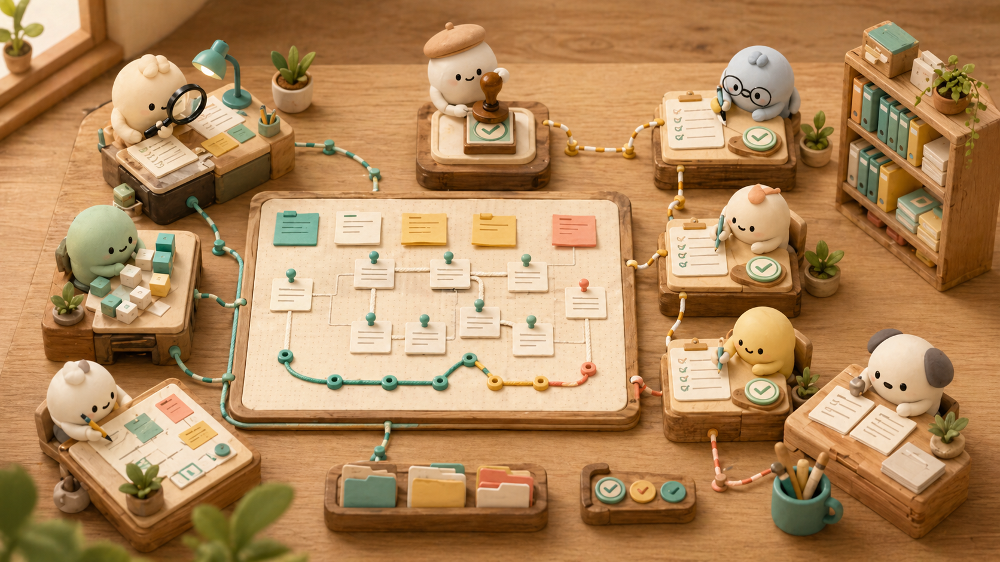
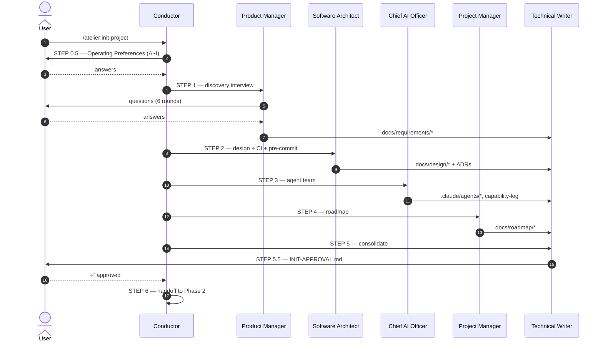
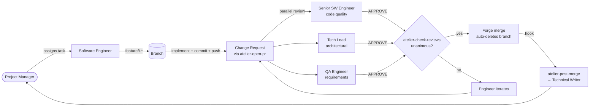

<p align="center">
  
</p>

<p align="center">
  <em>A universal multi-agent project harness for Claude Code.<br/>
  Run any project — web, data, ML, fintech, CLI — through a structured AI team with rigorous governance, from discovery to release.</em>
</p>

<p align="center">
  <a href="LICENSE"></a>
  <a href="meta/ROADMAP.md"></a>
  <a href="meta/ROADMAP.md"></a>
</p>

<p align="center">
  
</p>

---

## Table of Contents

- [What is atelier?](#what-is-atelier)
- [Why atelier?](#why-atelier)
- [Quickstart](#quickstart)
- [Core Concepts](#core-concepts)
- [The Nine Default Agents](#the-nine-default-agents)
- [The Phase 1 Workflow (Initialization)](#the-phase-1-workflow-initialization)
- [The Phase 2 Workflow (Execution)](#the-phase-2-workflow-execution)
- [Hard Enforcement Gates](#hard-enforcement-gates)
- [User Skills (Slash Commands)](#user-skills-slash-commands)
- [Configuration: Operating Preferences](#configuration-operating-preferences)
- [Customization & Extension](#customization--extension)
- [Forge Support](#forge-support)
- [Document Tree](#document-tree)
- [Self-Validation](#self-validation)
- [FAQ](#faq)
- [Troubleshooting](#troubleshooting)
- [Contributing](#contributing)
- [Roadmap](#roadmap)
- [Versioning](#versioning)
- [License & Notices](#license--notices)
- [Acknowledgments](#acknowledgments)

---

## What is atelier?

`atelier` is a Claude Code plugin that turns project execution into a **structured multi-agent workflow**. Instead of asking one Claude to "build me an app," you get:

- **Five Phase 1 specialists** who interview you, design the system, form a project-specific AI team, build the roadmap, and consolidate documentation — and then **wait for your explicit approval** before any code is written.
- **Four Phase 2 specialists** (a Software Engineer plus three independent reviewers) who implement tasks one-at-a-time through a PR / MR cycle with mandatory unanimous approval.
- **Twelve hooks** that hard-block the most common mistakes (force-push, skipped requirements, unreviewed merges) at the harness layer — *the model cannot bypass them*.

It works for **any project domain** (web app, data pipeline, fintech backend, ML system, CLI tool, mobile app) and **any forge** (GitHub, GitLab, Bitbucket, Gerrit, local-only).

## Why atelier?

### The problem

LLMs writing code are powerful, but in real projects they:
1. **Skip due diligence** — start coding before requirements are clear.
2. **Lose context** — forget design decisions across sessions or tasks.
3. **Drift in scope** — silently expand a small task into a refactor.
4. **Approve their own work** — single-agent setups have no independent review.
5. **Lose trace** — decisions vanish into transcripts that no one re-reads.

### The atelier approach

| Problem | atelier mitigation |
|---|---|
| Skipping due diligence | **6-file STEP gate**: feature branches blocked until requirements + design + roadmap + approval all exist. |
| Lost context | **Single Source of Truth** in `docs/` consulted by every agent. Glossary, ADRs, lessons-learned all append-only. |
| Scope drift | **QA Engineer** independently reviews every PR against original acceptance criteria. |
| Self-approval | **Three mandatory reviewers** (Senior Software Engineer, Tech Lead, QA Engineer) with independent lenses; unanimous required. |
| Lost decisions | **ADR triggers** mandate a written record for every consequential choice. Tech Lead blocks merges that fire a trigger without an ADR. |

### vs alternatives

| Setup | What you get | What you give up |
|---|---|---|
| Single-agent prompting | Speed, simplicity | Independent review, governance, trace |
| Manual multi-agent (custom prompts each time) | Flexibility | Reproducibility, cross-project consistency, gates |
| **atelier** | Structured team + governance + gates + trace | Some upfront ceremony at STEP 0.5 (offset by reusability) |

---

## Quickstart

### Prerequisites

- [Claude Code](https://claude.com/claude-code) installed and authenticated.
- A directory where you want to start a new project (or retrofit an existing one).
- Optionally: `gh` CLI (GitHub) or `glab` CLI (GitLab) for forge integration. `atelier-open-pr` will detect which one to use.

### Install

**From the official Anthropic marketplace (recommended)** — atelier is listed in `claude-plugins-official`, available in every Claude Code session by default:

```
/plugin install atelier@claude-plugins-official
```

**From the author's marketplace (alternative)** — install from the source repo via the `tokki-labs` marketplace:

```
/plugin marketplace add dudgns0908/atelier
/plugin install atelier@tokki-labs
```

The form is `<plugin-name>@<marketplace-name>`.

**From source (editable install for contributors)** — clone and load in place:

```bash
git clone https://github.com/dudgns0908/atelier
claude --plugin-dir /absolute/path/to/atelier-repo/atelier
```

`--plugin-dir` is **in-place loading** — no copy is made under `~/.claude/plugins/`. The plugin source directory IS the install location. Edits to the source are picked up on next invocation. This is a normal "editable install" pattern (similar to `pip install -e .`).

To verify atelier is loaded, run `/atelier:status` in any session — it should respond.

`skill-creator` is bundled inside `atelier/skills/skill-creator/` (Apache 2.0, see `NOTICE.md`). No extra dependencies are required.

### Start a new project

```
/atelier:init-project
```

You'll be guided through:

1. A short context and operating-preferences intake (≈10 questions across 9 sections).
2. A discovery interview (Product Manager).
3. Technical design (Software Architect — including CI and pre-commit setup).
4. Project-specific agent team formation (Chief AI Officer).
5. Roadmap construction (Project Manager).
6. Documentation consolidation (Technical Writer).
7. **A final approval gate** — you sign `docs/INIT-APPROVAL.md` before any code is written.

After approval, Phase 2 starts automatically and the first task is assigned.

---

## Core Concepts

### Two-Phase Model

```
Phase 1 — INITIALIZATION (one-time, ~30 min interview)
    ↓ user approval gate ↓
Phase 2 — EXECUTION (continuous task loop)
    ↑ escalations re-activate Phase 1 agents on demand ↑
```

After Phase 1 completes, the five Phase 1 agents enter **STANDBY**. They re-activate only when a defined trigger fires (requirement change, tech pivot, team adjustment, schedule shift, doc drift) via `/atelier:escalate`.

### Hard vs Soft Enforcement

- **Hard**: enforced by `hooks/hooks.json` and `settings.json`. The model *cannot bypass* — `exit 2` blocks the tool call.
- **Soft**: documented in agent personas and SKILL.md. Reliable when agents follow their instructions; relies on social/governance pressure otherwise.

The plugin design philosophy: **hard-enforce the few critical guardrails; trust the agents on everything else** — too many gates create friction that hurts more than it helps.

### Single Source of Truth

Every fact lives in exactly one canonical document:
- Requirements → `docs/requirements/`
- Design → `docs/design/`
- Roadmap → `docs/roadmap/`
- Decisions → `docs/ssot/decisions/` (ADRs, immutable once accepted)
- Domain terms → `docs/ssot/glossary.md` (original-language preserved)

Agents reference these documents instead of inlining knowledge. Technical Writer enforces this on every merged PR.

---

## The Eight Default Agents (+ project implementers)

atelier ships **8 default agents** in the plugin roster. Implementation agents are NOT defaults — Chief AI Officer creates them per project at STEP 3 from a template, so every project's implementation team fits its actual stack and domain.

### Phase 1 — Initialization (5)

| Agent | Role | Active in |
|---|---|---|
| **Product Manager** | What to build and why. Discovery interviews, acceptance criteria, scope guards. | STEP 1 (primary), Phase 2 escalations |
| **Software Architect** | How to build it. Tech stack, system design, folder structure, ADRs, CI, pre-commit. | STEP 2 (primary), Phase 2 escalations |
| **Chief AI Officer** | Who builds it. Designs the project-specific AI team. **The plugin's signature role.** | STEP 3 (primary), `/atelier:add-agent` |
| **Project Manager** | When and how to ship. Milestones, tasks, dependencies, risks. | STEP 4 (primary), every task assignment |
| **Technical Writer** | Where to record. Documentation tree, SSOT, glossary, post-merge sync. | STEP 5 (primary), every merged PR |

### Phase 2 — Execution reviewers (3)

| Agent | Role | Active in |
|---|---|---|
| **Senior Software Engineer** | PR reviewer #1 — code quality lens. | Every change request |
| **Tech Lead** | PR reviewer #2 — architectural alignment lens. | Every change request |
| **QA Engineer** | PR reviewer #3 — requirements & roadmap alignment lens. | Every change request |

### Phase 2 — Implementation agents (project-specific, CAIO-authored, **not in the default roster**)

Chief AI Officer creates these at STEP 3 from `docs/templates/software-engineer-template.md`. Examples (vary per project):

- For a single-domain CLI: a single `Software Engineer` named for the project.
- For a web app: `Frontend Engineer`, `Backend Engineer`.
- For a fintech project: `Backend Engineer (Payments)`, `Compliance Analyst`, `Security Engineer`.
- For ML: `ML Engineer`, `Data Engineer`, `MLOps Engineer`.

These instantiated agents live at `<user-project>/.claude/agents/<kebab-title>.md`. At least one is always created.

> **Naming discipline**: every agent uses a real industry job title (LinkedIn test). Never abbreviate `Product Manager` or `Project Manager` to "PM" — the abbreviation is ambiguous and forbidden across all artifacts.

---

## The Phase 1 Workflow (Initialization)



**Average duration**: 30–60 minutes for a typical project. The interview is structured but adaptive — questions deepen where you have certainty and broaden where you don't.

---

## The Phase 2 Workflow (Execution)



Each task is **one branch → one PR → unanimous three-reviewer approval → auto-merged → docs reconciled**. No exceptions baked into the harness.

---

## Hard Enforcement Gates

These run at the Claude Code harness layer. The model cannot bypass them.

| Gate | What it blocks | Where |
|---|---|---|
| **Forbidden git ops** | `--force` push, `--no-verify` commit, direct push to `main`/`develop` | `PreToolUse(Bash)` + `settings.json` deny |
| **STEP 5.5 6-file gate** | Creating any `feature/*` branch before all six STEP outputs exist and are non-empty | `PreToolUse(Bash)` |
| **Roadmap-task linkage** | Opening a change request via `atelier-open-pr` for a task that does not exist in `docs/roadmap/tasks/` | `PreToolUse(Bash)` |
| **Unanimous merge** | Merging via `gh pr merge` / `glab mr merge` without unanimous APPROVE from the three reviewers | `PreToolUse(Bash)` → `atelier-check-reviews` |
| **Forge auth** | Issuing forge API calls without authentication | `bin/atelier-open-pr`, `atelier-check-reviews` |
| **Post-merge sync** | Skipping documentation reconciliation after merge | `PostToolUse(Bash)` → `atelier-post-merge` (auto-fires) |

**Soft guards** (warnings, not blocks): Conventional Commits format, lint/format pre-commit, lessons-learned freshness, capability-log entries.

---

## User Skills (Slash Commands)

| Command | Purpose |
|---|---|
| `/atelier:init-project` | Run the full Phase 1 interview and produce an approved project setup. |
| `/atelier:status` | Dashboard: active milestone, in-progress tasks, open CRs, top risks, escalations. |
| `/atelier:escalate <agent> <reason>` | Re-activate one of the five Phase 1 agents to handle a drift. |
| `/atelier:milestone-checkpoint` | Run a milestone completion checkpoint with user approval. |
| `/atelier:add-agent <title> <reason>` | Add a project-specific agent mid-project (CAIO drafts, user approves). |
| `/atelier:add-skill <name> <reason>` | Add a project-specific skill (reuse audit + skill-creator drafting + capability-log). |
| `/atelier:add-mcp <name> <reason>` | Add an MCP server (reuse audit + ADR draft + user approval mandatory). |
| `/atelier:hotfix` | Produce a production hotfix from `main`, back-merge to `develop`. |
| `/atelier:release` | Cut a release: `develop → main`, tag, changelog, publish. |
| `/atelier:skill-creator` | Draft a new SKILL.md following Anthropic's authoritative structure (bundled). |

---

## Configuration: Operating Preferences

Every project's behavior is shaped by `docs/templates/operating-preferences-template.md`, filled at STEP 0.5:

| Section | Determines |
|---|---|
| **A. Involvement Level** | How often the user is asked to approve. Four presets: Fully Autonomous → Detailed Supervision. |
| **B. Language & Framework** | Pre-selected stack, banned technologies, deployment target. |
| **C. Methodology** | TDD / BDD / test-after / prototype-first / hybrid. |
| **D. Test Coverage Policy** | Overall target, critical-path thresholds, exemptions. |
| **E. Review Strictness** | Unanimous (default) or 2-of-3 majority with dissent recorded. |
| **F. Commit & Branch Policy** | Confirmations or overrides of plugin defaults (git-flow, Conventional Commits). |
| **G. Communication Channel** | CLI-only / Slack / Discord / custom. |
| **H. Code Forge** | GitHub / GitLab / Bitbucket / Gerrit / local-only. Drives forge-aware helpers. |
| **I. Code Quality Automation** | Pre-commit and CI lint/format/test policy. |

The user can revisit and amend at any time; changes take effect at the next task boundary.

---

## Customization & Extension

### Adding a project-specific agent

```
/atelier:add-agent "Backend Engineer (Payments)" "regulated payment domain requires dedicated expertise"
```

Chief AI Officer drafts the agent file, cites one of three specialization triggers (orthogonal domain / critical expertise / parallel track), records it in `docs/agents/team-composition.md`, and asks for your approval.

### Adding a skill

```
/atelier:add-skill "claim-ticket" "task-helper for claiming tickets from external queue"
```

The wrapper runs the four-step reuse audit, invokes the bundled `skill-creator` to draft the SKILL.md, places it under `.claude/skills/`, and reminds you to `/reload-plugins`.

### Adding an MCP server

```
/atelier:add-mcp "@modelcontextprotocol/slack" "Slack notifications were chosen at STEP 0.5 G"
```

Reuse audit → ADR draft → user approval (mandatory regardless of involvement level) → `.mcp.json` updated → install instructions printed for the user to run.

### Changing involvement level mid-project

Edit `docs/templates/operating-preferences-template.md` section A and announce the change. Effective at the next task boundary; never mid-PR.

### Specializing the Software Engineer

Chief AI Officer can replace or duplicate `software-engineer` with domain variants (Frontend Engineer, Backend Engineer, ML Engineer, DevOps Engineer, Security Engineer, etc.) following the rules in `docs/process/agent-team-sizing.md`. Real industry titles only.

---

## Forge Support

| Forge | PR/MR creation | Approval check | Adapter status |
|---|---|---|---|
| **GitHub** | `gh pr create` | `gh pr view --json reviews` | ✅ Full |
| **GitLab** | `glab mr create` | `glab api /merge_requests/.../approval_state` | ✅ Full |
| **Bitbucket** | manual (CLI stub) | manual | ⚠️ Stub |
| **Gerrit** | manual (CLI stub) | manual | ⚠️ Stub |
| **Local-only** | branch + `docs/roadmap/reviews/<task-id>.md` | manual | ✅ Documented |

Forge is auto-detected from `operating-preferences-template.md` H, with `--forge` override flag available on every helper.

---

## What You See When You Install atelier

Three surfaces are affected by `/plugin install atelier`. See [`README.md (Tier 1/2/3 sections)`](README.md (Tier 1/2/3 sections)) for the comprehensive breakdown. Summary:

### Tier 1 — atelier's own plugin directory (rarely seen)

`~/.claude/plugins/atelier/` (location depends on platform). Contains atelier's source: agents, skills, hooks, bin, process docs, maintainer docs. **You do not normally browse this**; you interact via slash commands.

### Tier 2 — your project directory (what matters)

After `/atelier:init-project` completes. Items honestly broken into **always**, **conditional**, **on-demand**, and **not yet in v0.1**.

**Always created** (every project gets these):

```
your-project/
├── CLAUDE.md                          # STEP 5  — project shared context
├── INIT-APPROVAL.md                   # STEP 5.5 — your sign-off
├── .claude/agents/                    # STEP 3  — project-specific agents (CAIO)
└── docs/
    ├── requirements/                  # STEP 1  — vision, requirements, ...
    ├── design/                        # STEP 2  — tech-stack, architecture, ...
    ├── agents/                        # STEP 3  — team-composition, capability-log, agent-specs/
    ├── flows/                         # STEP 3  — execution-flow, escalation-flow, escalation-log
    ├── roadmap/                       # STEP 4  — roadmap, milestones/, tasks/, risks, lessons-learned, checkpoints/
    ├── ssot/                          # STEPs 2–5 — glossary, decisions/, session-log/
    └── process/
        ├── README.md                  # navigation
        └── operating-preferences.md   # STEP 0.5 — YOUR A~I choices
```

> **Note**: `docs/process/` only contains your project-specific `operating-preferences-template.md` plus a README. The 15+ policy bodies (`change-review-workflow.md`, `git-flow.md`, etc.) live in atelier's plugin directory — agents reference them from there, they are NOT duplicated into your project.

**Conditional** (depend on STEP 0.5 / forge / lint level):

```
your-project/
├── .github/workflows/ci.yml         # forge=GitHub  → Software Architect generates
│   OR .gitlab-ci.yml                # forge=GitLab
└── .pre-commit-config.yaml          # if STEP 0.5 I level ≥ "Format only"
```

**Created on demand** (not at init time):

```
your-project/
├── .claude/skills/                  # ONLY if /atelier:add-skill is invoked
├── .mcp.json                        # ONLY if /atelier:add-mcp added a server
└── .atelier/last-reload-ack         # ONLY when reload-reminder fires
```

**Planned for v0.2 — NOT in v0.1**:

```
your-project/
└── .gitignore, LICENSE, .editorconfig, CODEOWNERS   # standard repo files (v0.2)
```

For now you create these yourself if needed.

**Source code**: whatever Software Architect's `docs/design/folder-structure.md` decides at STEP 2 (`src/`, `app/`, `cmd/`, etc.).

You **read and edit**: `CLAUDE.md`, `docs/requirements/`, `docs/roadmap/`, `docs/templates/operating-preferences-template.md`, source code.
You **rarely touch**: `docs/agents/`, `docs/flows/`, `docs/ssot/decisions/`, `.atelier/` — managed by agents.

### Tier 3 — active behaviors (invisible but watching)

While you work in this directory, atelier's hooks run automatically:
- 4 hard-block hooks (force-push, STEP-5.5 gate, unanimous merge, task-link).
- 2 post-action automation hooks (Conventional Commits warning, post-merge doc sync).
- 5 context hooks (SessionStart, UserPromptSubmit, Notification, PreCompact, Stop).

Plus 7 `atelier-*` bin helpers added to your PATH and 10 slash commands.

### What you do NOT see in your project

- atelier's default agent definitions (those stay in the plugin directory).
- atelier's `meta/` (ROADMAP, GOVERNANCE — never copied to your project).
- atelier's own `LICENSE`, `meta/version-history.md`, `CONTRIBUTING.md` (separate from your project's).

---

## Self-Validation

The plugin includes its own structural test:

```bash
bin/atelier-validate
```

Checks: manifest validity, required directories, all 9 agents + 9 skills present, all 15 process docs present, all 7 bin helpers executable, agent/skill frontmatter has required fields, no legacy references. Use this in CI for atelier itself.

---

## FAQ

**Q. Do I have to use all 9 agents?**
A. The 5 Phase 1 agents always run during init. The 4 Phase 2 agents always run during execution. Project-specific agents added by CAIO are optional and depend on your project size.

**Q. Can I skip Phase 1 if I already have a project?**
A. Currently `atelier` is designed for new projects. Retrofitting is possible by manually populating `docs/requirements/`, `docs/design/`, `docs/agents/team-composition.md`, `docs/roadmap/roadmap.md`, and `docs/INIT-APPROVAL.md`. A scripted retrofit is on the roadmap (see `meta/ROADMAP.md`).

**Q. What if I want to disable a hard gate?**
A. Edit `hooks/hooks.json` in your local plugin copy. We strongly recommend documenting any such change in `docs/ssot/decisions/`. Contributing the change back upstream is welcome if your use case is general.

**Q. How does atelier handle parallel work?**
A. STEP order in Phase 1 is mostly sequential (the 6-file gate enforces all artifacts exist before Phase 2). In Phase 2, multiple tasks can run in parallel as long as they don't conflict — `docs/process/change-review-workflow.md` describes the protocol.

**Q. What happens if the model deviates from a soft rule?**
A. Soft rules are encoded in agent personas. If you observe deviations, file a CONTRIBUTING.md issue with reproduction steps. Many soft rules can be hardened into hooks if the deviation pattern is common.

**Q. Can I use atelier for non-software projects?**
A. The agent roles, the artifact structure, and the review cycle are software-centric. Adaptation to documentation projects, research projects, or design projects is feasible but not yet tested. Feedback welcome.

**Q. Why "atelier"?**
A. A workshop where multiple specialists collaborate on a single work, continuously. The metaphor maps directly to the plugin: 9 specialists in one space, working together over the project's lifetime.

---

## Troubleshooting

| Symptom | Likely cause | Fix |
|---|---|---|
| `Blocked: feature/* branch creation requires the following STEP outputs...` | Phase 1 not completed (or one of the 6 files was deleted/empty). | Run `/atelier:init-project` to completion or restore the missing file(s). |
| `Blocked: change request N does not have unanimous approval` | One of the three reviewers has not approved. | Run `atelier-check-reviews <N>` to see who's missing; have them review. |
| `Blocked: no task file matching docs/roadmap/tasks/<id>-*.md` | Trying to open a CR for a task that's not in the roadmap. | Have Project Manager add the task file first. |
| `Cannot detect forge` | `operating-preferences-template.md` section H is empty and no `gh`/`glab` CLI on PATH. | Set the forge in section H, or pass `--forge github\|gitlab` flag, or install the appropriate CLI. |
| `Not authenticated to GitHub/GitLab` | Forge CLI not logged in. | Run `gh auth login` or `glab auth login`. |
| `atelier: new skill/agent/MCP file detected. Run /reload-plugins` | New capability files added but plugin not reloaded. | Run `/reload-plugins`, then `touch .atelier/last-reload-ack` to silence. |
| Conventional Commits warning every commit | Commit message doesn't match the format. | Use `<type>(<scope>): <subject>` format; see `docs/process/git-flow.md`. |

For deeper issues, run `bin/atelier-validate` and review the output.

---

## Contributing

We welcome contributions of all sizes — bug reports, doc fixes, hook improvements, new agents, new forge adapters, sample projects.

See [CONTRIBUTING.md](CONTRIBUTING.md) for:
- Development setup
- How to dogfood atelier on atelier itself
- Conventions (Conventional Commits, ADRs, real job titles)
- Pull request review process
- Sign-off requirement

For security issues, see [SECURITY.md](SECURITY.md). Do **not** file public issues for security vulnerabilities.

By participating you agree to abide by the [Code of Conduct](CODE_OF_CONDUCT.md).

---

## Roadmap

See [ROADMAP.md](meta/ROADMAP.md) for the path from current v0.1 to v1.0 GA. Highlights:

- **v0.2** — Sample projects, standard repo file generation, status `--json`, real-world dry-run validation.
- **v0.3** — Collaboration infrastructure (the file you're reading is part of this).
- **v0.4** — Operational maturity (incident response, security baseline, real migration scripts).
- **v0.5** — Comprehensive testing.
- **v1.0 GA** — API stability commitment, multi-domain validation, public adoption.

---

## Versioning

> **Two independent SemVer axes:**
> - **The atelier plugin's own version** (e.g., `0.1.0` → `1.0`) — what `.claude-plugin/plugin.json` carries. Tracked in `meta/version-history.md` and `meta/ROADMAP.md`.
> - **Your project's own version** when you use atelier (e.g., your app `1.2.3`) — managed by `/atelier:release`. **Independent** from atelier itself.
>
> Upgrading atelier does not bump your project's version, and vice versa.

`atelier` follows [SemVer](https://semver.org/) at the plugin level:

- **MAJOR** — breaking change to agent interfaces, skill arguments, doc tree structure, or required user actions.
- **MINOR** — new agent, new skill, new optional capability.
- **PATCH** — internal fixes, prompt tuning, documentation clarifications.

See [meta/version-history.md](meta/version-history.md) for release history. See [meta/version-history.md](meta/version-history.md) for migration between versions.

---

## License & Notices

`atelier` is licensed under the [Apache License 2.0](LICENSE).

Bundled third-party components retain their original licenses; see [NOTICE.md](NOTICE.md). Notable: `skills/skill-creator/` is bundled from [anthropics/skills](https://github.com/anthropics/skills) under Apache 2.0.

---

## Acknowledgments

- The bundled `skill-creator` is from [Anthropic's open Skills repository](https://github.com/anthropics/skills) — we use it unmodified under Apache 2.0.
- The plugin spec follows [Claude Code plugin documentation](https://code.claude.com/docs/en/plugins).
- The project-charter, ADR, and three-reviewer review patterns are inspired by industry practice (PMI, AWS Well-Architected, Microsoft Engineering Excellence) and adapted for AI-team execution.

---

## Project Health

| Metric | Status |
|---|---|
| Self-validation | ✅ All checks passed |
| Hard enforcement gates | 6 active |
| Default agents | 9 |
| Skills | 9 (atelier) + 1 (bundled) |
| Process documents | 15 |
| Hook handlers | 12 |
| Forge adapters | GitHub ✅ · GitLab ✅ · Bitbucket ⚠️ · Gerrit ⚠️ |
| Real-world dry-run | ⚠️ Pending v0.2 |

---

**Questions, ideas, or feedback?** Open an issue, start a discussion, or drop into the project's communication channel as configured for your team.
