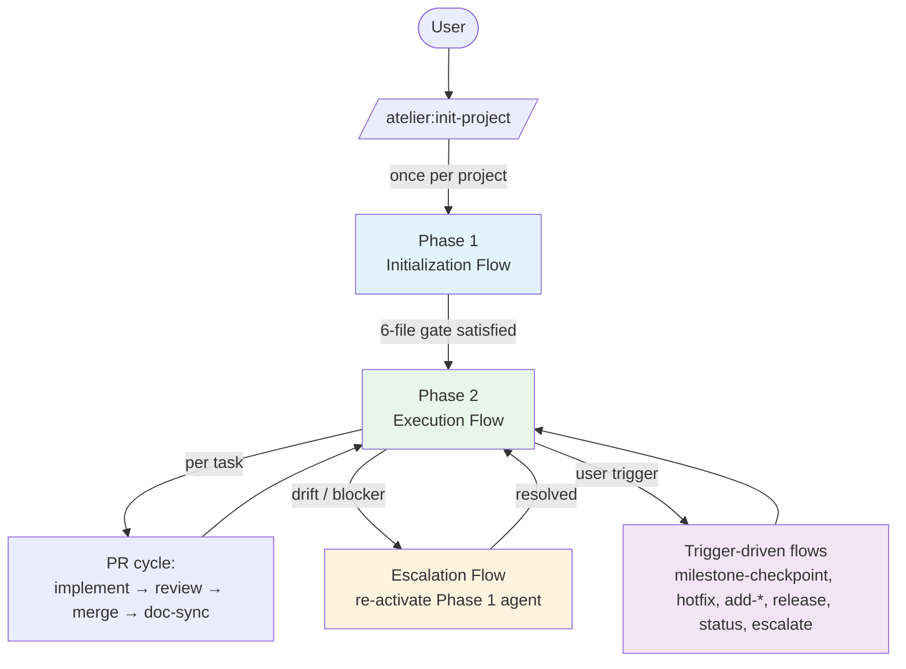
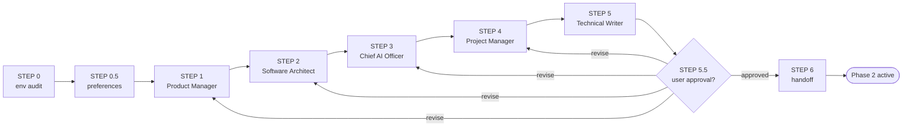
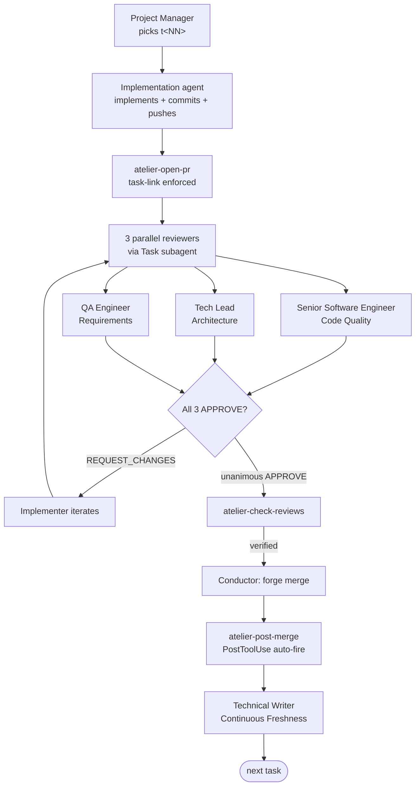
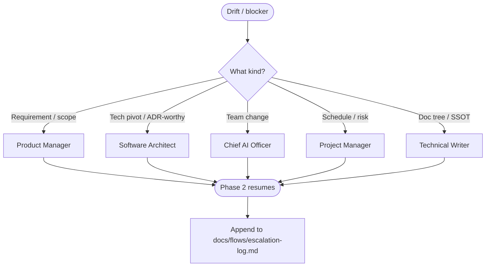

# Agent × Document × Purpose Map

**The flow master reference.** For each flow in atelier, this document captures: who participates, what they read, what they produce, and *why*.

For narrative depth and mermaid diagrams, see the per-flow files (`initialization-flow.md`, `execution-flow.md`, `escalation-flow.md`, `agent-communication.md`). Use **this** file when you want a single at-a-glance view.

---

## Visual Overview (read me first)

The whole project layered:

```
┌─────────────────────────────────────────────────────────────┐
│                    User (CEO/Owner)                         │
│                          ↓ commands                         │
│                      Conductor                              │
│              (main thread; routes only, no domain work)     │
└─────────────────────────────────────────────────────────────┘
                          ↓ Task tool
        ┌────────────┬────────────┬────────────┬────────────┐
        ▼            ▼            ▼            ▼            ▼
     [Phase 1]                                          [Phase 2]
   5 specialists                                    3 reviewers + N implementers
```

Every interaction belongs to one of **four flows**:

```
              ┌─────────────────────────────────┐
              │   1. Initialization (one-time)  │
              │   /atelier:init-project         │
              └─────────────┬───────────────────┘
                            │ 6-file gate satisfied
                            ▼
              ┌─────────────────────────────────┐
   ┌─────────▶│   2. Execution (continuous)     │◀─────────┐
   │          │   PR cycle                      │          │
   │          └─────────────┬───────────────────┘          │
   │                        │                              │
   │            blocked      │            triggered         │
   │          ┌─────────────┴─────────────┐                │
   │          ▼                           ▼                │
   │  ┌──────────────┐            ┌──────────────┐         │
   └──┤ 3.Escalation │            │4.Trigger-flow│─────────┘
      │ Phase 1 reactivate         │milestone, etc.│        │
      └──────────────┘            └──────────────┘
```

### Flow 1 walkthrough — Initialization

```
User: /atelier:init-project
       │
       ▼
  ┌───────────────────────────────────────┐
  │ STEP 0   Conductor                    │  auto-detect empty/existing
  │ STEP 0.5 Conductor                    │  9 A~I defaults snapshot + "any to change?"
  └───────────────────────────────────────┘
       │
       ▼
  ┌─────────────┐ Product Manager
  │ STEP 1      │ → discovery interview (one open question per turn)
  │ Requirements│ 📥 reads:  discovery-interview-guide.md
  │             │ 📤 writes: docs/requirements/*
  └──────┬──────┘
         ▼
  ┌─────────────┐ Software Architect
  │ STEP 2      │ → stack, architecture, data model
  │ Design      │ 📥 reads:  docs/requirements/*, capability-management.md
  │             │ 📤 writes: docs/design/*, ADRs
  │             │ ⚔ PM challenges: "covers all requirements?"
  └──────┬──────┘
         ▼
  ┌─────────────┐ Chief AI Officer (CAIO)
  │ STEP 3      │ 3a. Capability survey (Skills/MCPs reuse audit + import)
  │ Team +      │ 3b. Agent team design (real titles, sizing rules)
  │ Capabilities│ 📥 reads:  agent-team-sizing.md, software-engineer-template.md,
  │             │            capability-management.md, design/*
  │             │ 📤 writes: capability survey table (chat),
  │             │            .claude/agents/<role>.md, team-composition.md,
  │             │            capability-log.md
  │             │ ⚔ PM/Architect/PMO challenge in same chat
  └──────┬──────┘
         ▼
  ┌─────────────┐ Project Manager
  │ STEP 4      │ → milestones, tasks, deps, risks
  │ Roadmap     │ 📥 reads:  requirements/*, design/*, team-composition.md
  │             │ 📤 writes: docs/roadmap/*
  │             │ ⚔ CAIO challenges: "team can deliver?"
  └──────┬──────┘
         ▼
  ┌─────────────┐ Technical Writer ★ critical
  │ STEP 5      │ → READMEs + glossary + <project>/CLAUDE.md (runtime manual)
  │ Doc consol. │ 📥 reads:  project-claude-template.md + all STEP outputs
  │             │ 📤 writes: <project>/CLAUDE.md (loaded every session)
  └──────┬──────┘
         ▼
  ┌─────────────┐ Conductor + User
  │ STEP 5.5    │ 6-section summary → "proceed?"
  │ Approval    │ ✅ → INIT-APPROVAL.md "Approved by user: <date>"
  │             │ ❌ → loop back to specific STEP
  └──────┬──────┘
         ▼
  ┌─────────────┐ Conductor
  │ STEP 6      │ git init, develop branch, Phase 1 agents → STANDBY
  └──────┬──────┘
         ▼
   Phase 2 active
```

**Hard gate**: 6 files must exist + non-empty + INIT-APPROVAL has `Approved by user:` line, else `git checkout -b feature/*` is hook-blocked.

### Flow 2 walkthrough — Execution (the everyday loop)

```
              ┌──────────────────────────────┐
              │  Project Manager: pick task   │
              │  📥 docs/roadmap/*            │
              │  📤 task t<NN> = "assigned"   │
              └─────────────┬────────────────┘
                            ▼
        ┌──────────────────────────────────────┐
        │  Implementation agent (CAIO-made)     │
        │  e.g., backend-engineer / cli-engineer│
        │  📥 task file, design/*, coding-principles.md
        │  • git checkout -b feature/t<NN>-*    │
        │  • code + Conventional Commits        │
        │  • pre-commit hook                    │
        │  • git push                           │
        │  • atelier-open-pr (task-link gate)   │
        └─────────────┬────────────────────────┘
                      ▼
                  PR opened
                      │
       ┌──────────────┼──────────────┐
       ▼              ▼              ▼
  ┌──────────┐  ┌──────────┐  ┌──────────┐
  │ Senior   │  │ Tech     │  │ QA       │
  │ Software │  │ Lead     │  │ Engineer │
  │ Engineer │  │          │  │          │
  │[Code     │  │[Architect│  │[Reqs +   │
  │ Quality] │  │ +team-bnd│  │ scope]   │
  │ +posting]│  │ +cap-gap │  │          │
  │          │  │  router] │  │          │
  │📥 review-│  │📥 design │  │📥 reqs/* │
  │ checklist│  │ /*, team-│  │ roadmap/*│
  │          │  │ comp,ADR │  │ task     │
  │          │  │ triggers │  │          │
  │ ★ form   │  │ ★ form   │  │ ★ form   │
  │ verdict  │  │ verdict  │  │ verdict  │
  │ first →  │  │ first →  │  │ first →  │
  │ then dedup│  │ then dedup│ │ then dedup│
  │ at posting│  │ at posting│ │ at posting│
  └────┬─────┘  └────┬─────┘  └────┬─────┘
       │             │              │
       └──────┬──────┴──────────────┘
              ▼
       all APPROVE? ─── NO ──▶ implementer iterates → re-review
              │
             YES
              ▼
       ┌──────────────────────────────┐
       │  Conductor:                   │
       │  atelier-check-reviews <CR>  │  ← hook blocks merge if not unanimous
       │  ✅ → forge merge             │
       └─────────────┬────────────────┘
                     ▼
       ┌──────────────────────────────┐
       │  PostToolUse hook auto-fires  │
       │  → atelier-post-merge         │
       │  → Technical Writer wakes up  │
       └─────────────┬────────────────┘
                     ▼
       ┌──────────────────────────────┐
       │  Technical Writer             │
       │  Continuous Freshness:        │
       │  • inspect diff               │
       │  • update affected docs       │
       │  • append glossary terms      │
       │  • follow-up issue if ADR missed
       └─────────────┬────────────────┘
                     ▼
              next task → repeat
```

**Posting Protocol (every reviewer)**: form your verdict and comments **before** reading other reviewers'. Then deduplicate at posting: net-new findings as `[lens] ...`; concur with `[lens] +1 to <reviewer>`; deltas as `[lens] Agree with <reviewer>; adding ...`; disagreements explicitly. See `docs/process/review-checklists.md` § Posting Protocol.

### Flow 3 walkthrough — Escalation

```
   Implementer: "design assumption is wrong" (or Tech Lead at PR)
              │
              ▼ (no direct Phase 1 call! through Conductor)
       ┌───────────────────────────┐
       │ Conductor:                 │
       │ /atelier:escalate <agent>  │
       │ → escalation-log.md         │
       │ → Phase 2 paused            │
       └─────────┬─────────────────┘
                 ▼
        ┌────── what kind? ──────┐
        │                       │
   req-change tech-pivot team schedule docs
        │       │       │      │      │
        ▼       ▼       ▼      ▼      ▼
       PM   Architect  CAIO   PMO   TechWriter
        │       │       │      │      │
        ▼       ▼       ▼      ▼      ▼
   reqs/*    design/* team-   roadmap docs/
   updated   +ADR     comp/*  /risks  reorg
                        │
                        ▼ (involvement-level dependent)
           Detailed Sup → user approves every escalation
           Milestone+   → user approves big changes
           Fully Auto   → log only
                 ▼
            Phase 2 resumes
```

### Flow 4 — Trigger-driven (skill commands)

User invokes a skill outside the regular task cycle. Each is self-contained and goes through the **capability approval chain** if it touches agents/skills/MCPs:

```
   any agent detects gap (or user invokes /atelier:add-* directly)
              │
              ▼ proposes
       ┌───────────────────────────┐
       │ Tech Lead (router)        │  ← validates: reuse audit done?
       │ • duplicate? gap real?    │     scope/security ok?
       │ • forwards or rejects     │
       └───────────┬───────────────┘
                   ▼ approved-to-forward
       ┌───────────────────────────┐
       │ Chief AI Officer (final)   │  ← decides + drafts artifact
       └───────────┬───────────────┘
                   ▼
       ┌───────────────────────────┐
       │ User approval              │  ← MCP: ALWAYS. Agent: ALWAYS.
       │                            │     Skill: per involvement level.
       └───────────┬───────────────┘
                   ▼
            Capability live + capability-log row
```

This chain applies to: `/atelier:add-agent`, `/atelier:add-skill`, `/atelier:add-mcp`. See `docs/process/capability-management.md` § Approval Chain for full procedure.

---

## Flow Catalog

atelier has four flow categories. Every interaction belongs to exactly one.



| Flow | Cardinality | Entry | Exit |
|---|---|---|---|
| **1. Initialization** | once per project | `/atelier:init-project` | INIT-APPROVAL.md signed → Phase 2 |
| **2. Execution** | continuous in Phase 2 | task picked from roadmap | task merged + docs synced |
| **3. Escalation** | as needed | `/atelier:escalate <agent>` | re-activated agent updates docs → Phase 2 resumes |
| **4. Trigger-driven** | as needed | user invokes a skill | skill completes |

---

## Universal References (every agent + Conductor honors, every flow)

These are the contract loaded into every session. All flows assume them.

| Document | What it carries | When applied |
|---|---|---|
| `<project>/CLAUDE.md` (generated at STEP 5) | Conductor runtime manual: layer model, routing table, hard rules, core principles | Every session |
| `docs/process/coding-principles.md` | Naming, language, simplicity, critical thinking, interview discipline | Every artifact-producing turn |
| `docs/process/living-documentation.md` | Same-PR doc updates, SSOT rule, what "up-to-date" means concretely | Every change |
| `docs/process/operating-preferences-template.md` (filled, this project) | A~I project-specific knobs (involvement, stack, methodology, …) | Read-once at session start; honored throughout |

---

## 1. Initialization Flow (Phase 1)

**Goal**: take a user from empty directory to a Phase-2-ready project (requirements, design, agent team, roadmap, docs, approval).

**Owner**: Conductor (orchestrates 5 specialist agents in sequence).

**Hard gate**: STEP 5.5 6-file approval — `git checkout -b feature/*` is hook-blocked until all six STEP outputs exist and `INIT-APPROVAL.md` contains `Approved by user: <date>`.



| STEP | Agent (Owner) | Purpose | Reads | Writes |
|---|---|---|---|---|
| **0** | Conductor | Detect new vs existing project; verify env (skill-creator bundled, no external check) | working dir contents | (sets internal state) |
| **0.5** | Conductor | Capture A~I operating preferences via batched defaults snapshot + single change-prompt | `docs/templates/operating-preferences-template.md`, `docs/process/user-involvement-levels.md` | `docs/process/operating-preferences-template.md` (filled into project) |
| **1** | **Product Manager** | Discovery interview — vision, success criteria, stakeholders, constraints. *One open-ended question per turn.* | `docs/process/discovery-interview-guide.md`, A.involvement-level | `docs/requirements/vision.md`, `success-criteria.md`, `stakeholders.md`, `constraints.md`, `requirements.md` |
| **2** | **Software Architect** | Technical design — stack, architecture, data model, folder structure, integrations, CI/pre-commit policy. Audit MCP/skill reuse before proposing new tools. | `docs/requirements/*`, `docs/process/capability-management.md`, `docs/process/code-quality-automation.md`, `docs/README.md#ssot-schema` | `docs/design/architecture.md`, `data-model.md`, `folder-structure.md`, `integrations.md`, ADRs in `docs/ssot/decisions/`, `docs/agents/capability-log.md` (initial entries) |
| **2-challenge** | Product Manager | Verify design covers stated requirements; raise ≥1 concrete reservation. | `docs/design/*`, `docs/requirements/*` | (chat verdicts only) |
| **3a** | **Chief AI Officer** | **Capability survey** — primary discoverer. Inventory existing skills/MCPs (atelier bundled, user plugins, Anthropic Skills marketplace, modelcontextprotocol.io, public registries). For each project need: decide reuse / extend / create. | `docs/process/capability-management.md` (four-step audit), bundled `skills/`, `~/.claude/plugins/`, external registries | capability survey table (chat), import targets identified |
| **3b** | **Chief AI Officer** | Agent team design. Batched propose-in-chat (full file content) → cross-discipline challenge → write `.claude/agents/*` only after revision. | `docs/process/agent-team-sizing.md`, `docs/templates/software-engineer-template.md`, `docs/design/*` | `.claude/agents/<role>.md` (each project-specific implementation agent), `docs/agents/team-composition.md`, `docs/agents/capability-log.md` (agent + capability rows) |
| **3-challenge** | Product Manager + Software Architect + Project Manager | Cross-discipline review — requirements coverage, executability, deliverability. Each raises ≥1 concrete reservation. | proposed agents (in chat) | (chat verdicts only) |
| **4** | **Project Manager** | Roadmap construction — milestones, tasks (DoR-ready), dependencies, risks, lessons-learned (empty). | `docs/requirements/*`, `docs/design/*`, `docs/agents/team-composition.md` | `docs/roadmap/milestones.md`, `tasks/t<NN>-*.md`, `dependencies.md`, `risks.md`, `lessons-learned.md` |
| **4-challenge** | Chief AI Officer | Team-deliverability check — does the team-composition match roadmap pace? | roadmap (in chat) | (chat verdict only) |
| **5** | **Technical Writer** | Doc consolidation: README per folder, glossary, **generate `<project>/CLAUDE.md` from `docs/templates/project-claude-template.md`** filling in STEP 0.5 preferences, vision, agent team list. | `docs/templates/project-claude-template.md`, all STEP outputs | `docs/README.md` + every subfolder README, `docs/ssot/glossary.md`, **`<project>/CLAUDE.md`** (Conductor runtime manual) |
| **5.5** | Conductor + User | Approval gate — present 6-section summary, await user "proceed" or revision request. | All step outputs | `INIT-APPROVAL.md` with `Approved by user: <date>` |
| **6** | Conductor | Handoff — `git init` if needed, transition Phase 1 agents to STANDBY, announce Phase 2 active. | (verifies 6-file gate satisfied) | git repo initialized, `develop` branch, agents marked STANDBY |

**Cross-flow effects**:
- STEP 0.5 result (involvement level) shapes how STEP 1 PM interviews and how Phase 2 Conductor decides what needs user approval.
- STEP 2 ADR triggers must be honored throughout Phase 2 — every reviewer checks for them at PR time.
- STEP 5's generated `<project>/CLAUDE.md` is loaded in *every subsequent session* — it's the single most leveraged artifact.

See: `docs/flows/agent-document-map.md` for full mermaid sequence + state diagram.

---

## 2. Execution Flow (Phase 2)

**Goal**: deliver each task with an enforceable code-review gate, keep docs in lock-step with code.

**Owner**: Conductor routes; Project Manager + implementation agent + 3 reviewers + Technical Writer execute.

**Hard gates** (from `hooks/hooks.json`):
- Direct `git merge feature/*` blocked.
- `git push origin develop` / `main` blocked.
- `--force`, `--no-verify` blocked.
- `atelier-open-pr` aborts if no roadmap task linked.
- `atelier-check-reviews` returns non-zero unless 3-reviewer unanimous APPROVE.
- Merge command auto-fires `atelier-post-merge` PostToolUse hook.



| Step | Agent | Purpose | Reads | Writes |
|---|---|---|---|---|
| **Pick task** | **Project Manager** | Iteration planning — select next DoR-ready task respecting deps, risks, capacity. | `docs/roadmap/milestones.md`, `tasks/`, `dependencies.md`, `risks.md`, `lessons-learned.md`, escalation-log | task status `assigned` in `docs/roadmap/tasks/t<NN>-*.md` |
| **Implement** | **Implementation agent** (CAIO-made, e.g., backend-engineer) | Deliver the task within its declared boundary. Branch `feature/t<NN>-<slug>` from `develop`. | task file, `docs/design/*`, `docs/process/coding-principles.md`, `docs/process/git-flow.md`, `docs/agents/team-composition.md` (own boundary) | feature branch + Conventional Commits + same-PR doc updates per `docs/process/living-documentation.md` |
| **Open PR** | Implementation agent | Request review with task-traceable PR. | `docs/process/change-review-workflow.md` | PR via `bin/atelier-open-pr` (forge-aware) |
| **Review (Code Quality)** | **Senior Software Engineer** | Code-quality lens — correctness, readability, tests, performance, security, scope, code-level doc freshness. | `docs/process/review-checklists.md` (Code Quality section + Posting Protocol), `docs/design/folder-structure.md`, diff, linked task | PR comments prefixed `[Code Quality]` + verdict (independent first, deduplicated at posting) |
| **Review (Architecture)** | **Tech Lead** | Architectural lens — design conformance, boundaries, **team-boundary** (delegated CAIO concern), data model, ADR presence, capability log. | `docs/process/review-checklists.md` (Architectural), `docs/design/*`, `docs/agents/team-composition.md`, `docs/agents/capability-log.md`, `docs/ssot/decisions/`, diff | PR comments prefixed `[Architecture]` + verdict |
| **Review (Requirements)** | **QA Engineer** | Requirements lens — acceptance criteria, milestone fit, vision alignment, scope bounds, regression risk, requirements-doc freshness. | `docs/process/review-checklists.md` (Requirements), `docs/requirements/*`, `docs/roadmap/*`, task file, diff | PR comments prefixed `[Requirements]` + verdict |
| **Verify** | Conductor | Unanimous-approve gate. Hook-enforced before merge. | `bin/atelier-check-reviews` (calls forge API or reads `docs/roadmap/reviews/<task-id>.md` for local-only) | success/fail signal |
| **Merge** | Conductor | Execute forge merge (or local fast-forward in local-only mode) with branch cleanup. | (forge: `gh pr merge` / `glab mr merge`) | merged change request, branch deleted |
| **Post-merge sync** | **Technical Writer** (auto-fired by `PostToolUse` → `atelier-post-merge`) | Continuous Freshness Workflow — reconcile diff against doc mapping, append glossary terms, raise retroactive issue if ADR missed. | merged diff, mapping in `docs/process/living-documentation.md`, current `docs/*` | updated `docs/`, `docs/ssot/glossary.md`, follow-up issue if needed |

**Cross-flow effects**:
- A REQUEST_CHANGES that demands a design pivot → escalation flow (Tech Lead routes to Software Architect).
- A REQUEST_CHANGES that demands a team-boundary decision → escalation flow (Tech Lead routes to CAIO).
- Repeated similar review failures → milestone-checkpoint trigger (PM aggregates lessons-learned).

See: `docs/flows/agent-document-map.md` for full sequence + reviewer gate diagrams. `docs/flows/agent-communication.md` § Scenario 2 / 5 for protocol details.

---

## 3. Escalation Flow

**Goal**: when Phase 2 cannot proceed without a Phase 1 decision, re-activate the relevant Phase 1 agent. Pause other Phase 2 work until resolved.

**Owner**: Conductor mediates — implementation agents never call Phase 1 agents directly.



| Trigger | Re-activated Agent | Purpose | Reads | Writes |
|---|---|---|---|---|
| Requirement change / stakeholder ask / scope adjustment | **Product Manager** | Re-scope; update success criteria if needed. | `docs/requirements/*`, escalation context, current PRs/tasks | updated `docs/requirements/*`, propagation note in `escalation-log.md` |
| Tech pivot / architectural refactor / ADR-worthy decision | **Software Architect** | Re-design within constraint. Always produce an ADR. | `docs/design/*`, `docs/ssot/decisions/`, implementer's evidence | updated `docs/design/*`, new ADR, `capability-log.md` if tooling changed |
| Add/remove agent / team boundary unclear | **Chief AI Officer** | Re-team. Use `/atelier:add-agent` or directly amend team-composition. | `docs/agents/team-composition.md`, `docs/process/agent-team-sizing.md`, current PR (if Tech Lead routed) | updated `team-composition.md`, new/removed `.claude/agents/*`, `capability-log.md` row |
| Schedule shift / new risk / milestone re-plan | **Project Manager** | Re-plan. Adjust milestones, surface risks, re-sequence tasks. | `docs/roadmap/*`, escalation context | updated `milestones.md`, `risks.md`, task statuses, `lessons-learned.md` |
| Doc tree restructure / SSOT violation / dead link | **Technical Writer** | Re-organize. Merge duplicates, refresh glossary, update READMEs. | all `docs/*` | restructured `docs/`, `glossary.md` delta, README updates |

**Always**:
- One escalation in flight at a time. Subsequent ones queue.
- `escalate` skill writes `docs/flows/escalation-log.md` (append-only).
- Resume is Conductor's call after the re-activated agent commits doc updates.
- Per involvement level, user approval may be required before resume (Detailed Supervision: every escalation; Milestone+: only if requirements/team change; Fully Autonomous: log only).

See: `docs/flows/agent-document-map.md` for full routing diagram + cross-step effects. `docs/flows/agent-communication.md` § Scenario 4 for protocol.

---

## 4. Trigger-driven Flows (skill commands)

User-invoked skills outside the regular task cycle. Each is a self-contained mini-flow.

| Skill | When | Owner | Reads | Writes |
|---|---|---|---|---|
| `/atelier:status` | "what's the state?" | Conductor | `docs/roadmap/*`, `docs/agents/team-composition.md`, escalation-log, recent PRs | dashboard rendering (chat only) |
| `/atelier:milestone-checkpoint` | end of milestone | **Project Manager** + Phase 1 agents (re-engaged for retro) | `docs/roadmap/milestones.md`, `tasks/`, `lessons-learned.md`, recent escalations | retro entry in `lessons-learned.md`, milestone marked done, next milestone DoR check |
| `/atelier:add-agent` | new domain capability needed | proposer (any agent) → **Tech Lead** (validates) → **CAIO** (final, authors) → user (always) | `docs/process/capability-management.md` § Approval Chain, `docs/agents/team-composition.md`, `docs/templates/software-engineer-template.md`, `docs/process/agent-team-sizing.md` | new `.claude/agents/<role>.md`, updated `team-composition.md` + `capability-log.md` (with proposer + chain audit trail) |
| `/atelier:add-skill` | repetitive workflow → reusable | proposer (any agent) → **Tech Lead** (validates reuse audit, scope) → **CAIO** (final, drafts via `skill-creator`) → user (per involvement) | `docs/process/capability-management.md`, existing `skills/*/SKILL.md`, `skills/skill-creator/` | new `skills/<name>/SKILL.md` + capability-log row |
| `/atelier:add-mcp` | new external tool/service | proposer (any agent) → **Tech Lead** (validates, security) → **CAIO** (final, drafts ADR) + Architect (technical fit challenge) → user (always) | `docs/process/capability-management.md`, `docs/README.md#ssot-schema`, modelcontextprotocol.io | ADR (mandatory), `.mcp.json`, `capability-log.md` row |
| `/atelier:hotfix` | production issue | **Project Manager** + relevant implementation agent | `docs/process/git-flow.md` (hotfix branch policy), incident context | `hotfix/<id>` branch, expedited PR (still 3-reviewer), post-fix retrospective in `lessons-learned.md` |
| `/atelier:release` | release ready | **Project Manager** + Tech Lead | `docs/process/release-process.md`, `docs/roadmap/milestones.md` | release branch / tag, version bump, release notes |
| `/atelier:escalate <agent> <reason>` | drift / blocker | varies (see Flow 3) | `docs/flows/agent-document-map.md`, escalation context | entry in `escalation-log.md`, agent re-activation |

---

## Per-Agent Quick Index

For when you want "what does agent X do, where, and with what?":

| Agent | Phase 1 role | Phase 2 default | Trigger re-engagement | Primary docs they OWN |
|---|---|---|---|---|
| **Conductor** (main thread) | orchestrate STEPs 0/0.5/5.5/6 | always active — routes, never authors domain content | always | `<project>/CLAUDE.md` (loaded, not authored — Tech Writer authors) |
| **Product Manager** | STEP 1 owner, STEP 2 challenger | STANDBY | escalate (req-change), milestone-checkpoint | `docs/requirements/*` |
| **Software Architect** | STEP 2 owner, STEP 3 challenger | STANDBY | escalate (tech pivot), milestone-checkpoint, add-mcp | `docs/design/*`, `docs/ssot/decisions/` |
| **Chief AI Officer** | STEP 3 owner, STEP 4 challenger | STANDBY | add-agent, add-mcp (challenger), escalate (team), milestone-checkpoint, hotfix-with-team-impact | `docs/agents/team-composition.md`, `docs/agents/capability-log.md`, `.claude/agents/*` |
| **Project Manager** | STEP 4 owner | active — task selection every iteration | always (per-task) | `docs/roadmap/*` |
| **Technical Writer** | STEP 5 owner — generates `<project>/CLAUDE.md` | post-merge auto-fire | always (every merge) | `docs/README.md` + every subfolder README, `docs/ssot/glossary.md`, `<project>/CLAUDE.md` |
| **Senior Software Engineer** | — | per-PR reviewer (Code Quality) | always | (no doc ownership — applies `review-checklists.md`) |
| **Tech Lead** | — | per-PR reviewer (Architecture) + delegated CAIO team-boundary check | always | (no doc ownership — may draft ADR) |
| **QA Engineer** | — | per-PR reviewer (Requirements) | always | (no doc ownership — verifies requirements docs) |
| **Implementation agents** (CAIO-made) | — | per-task implementer within own boundary | when task assigned | their declared module(s) per `team-composition.md` |

---

## Forbidden Communication Patterns

These violate the protocol — see `docs/flows/agent-communication.md` for detection and fix:

1. Direct agent-to-agent invocation (must route through Conductor).
2. Bypassing the document layer (chat-only resolution without doc update).
3. Cross-Phase direct activation (implementer calling Phase 1 agent).
4. Reviewer-to-implementer direct chat (review feedback in PR only).
5. Phase 1 agent silently re-activating mid-Phase-2 (explicit trigger required).
6. Self-narrating without writing the artifact.

---

## See Also

- `docs/flows/agent-document-map.md` — Phase 1 narrative + state diagram
- `docs/flows/agent-document-map.md` — Phase 2 narrative + reviewer gate
- `docs/flows/agent-document-map.md` — escalation routing + cross-step effects
- `docs/flows/agent-communication.md` — protocol contract (5 canonical scenarios + anti-patterns)
- `docs/flows/escalation-log.md` — append-only history of past escalations
- `docs/process/coding-principles.md` — universal behavioral contract
- `docs/process/living-documentation.md` — doc-update obligation
- `docs/process/review-checklists.md` — 3-reviewer lenses + Posting Protocol
- `<project>/CLAUDE.md` — Conductor runtime manual (generated at STEP 5)
