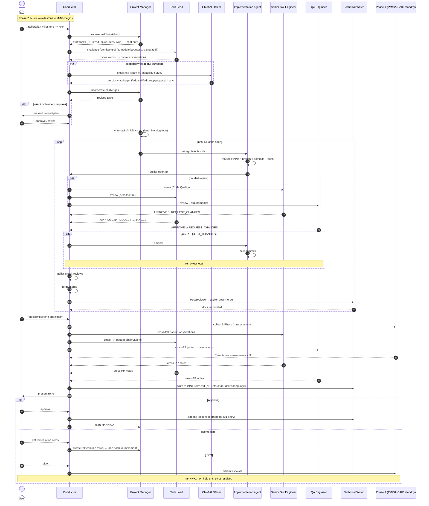

# Milestone Flow

The complete loop a user follows in **Phase 2** — from starting a milestone, through PR-sized tasks with 3-reviewer review, to milestone retrospective and decision (proceed / remediate / pivot).

This doc complements the per-PR `execution-flow.md` by zooming out one level: a milestone is the *unit of value delivery*, a task is the unit of work *within* a milestone.

---

## Bird's-eye view

```
              ┌─ /atelier:init-project (one-time, 6 STEPs + 5.5 approval gate) ─┐
              │  Phase 1 — milestones defined in roadmap; first milestone tasks  │
              └────────────────────────────┬───────────────────────────┘
                                           ▼
                              [ Phase 2 begins ]
                                           ▼
   ┌─────────────────────────────────────────────────────────────────┐
   │  Start milestone m<NN>                                          │
   │  /atelier:plan-milestone <m-id>            (v0.3.4)             │
   │                                                                 │
   │  Multi-agent decomposition (mirrors STEP 2/3/4 challenge        │
   │  pattern — proposer → cross-agent challenge → user review):     │
   │                                                                 │
   │  1. PM (proposer) drafts task breakdown:                        │
   │     • PR-sized (½–2 days each, ~100–500 LOC)                    │
   │     • epics grouping deps + ACs as checkboxes                   │
   │     • lane = backlog (some promoted to todo)                    │
   │                                                                 │
   │  2. Tech Lead (mandatory challenger) — same chat:               │
   │     • architectural fit: tasks consistent with architecture.md? │
   │     • module boundary: any task crosses agent boundaries        │
   │       (per team-composition.md)?                                │
   │     • current code state: any task assumes code that doesn't    │
   │       exist yet but isn't gated by depends_on?                  │
   │     • sizing audit: any task that smells > 2-day?               │
   │                                                                 │
   │  3. CAIO (conditional challenger) — only if PM or Tech Lead     │
   │     flagged a capability gap or team-composition concern:       │
   │     • Is the current team able to deliver these tasks?          │
   │     • Missing role (e.g., service-with-UI but no Designer)?    │
   │     • Skill / MCP gap to surface via /atelier:add-* chain?     │
   │                                                                 │
   │  4. PM revises in chat after challenges. Files written only     │
   │     after revision settles.                                     │
   │                                                                 │
   │  5. User reviews per involvement level (Detailed Sup → every    │
   │     plan-milestone; Milestone+ → only if scope shifted; Fully   │
   │     Auto → log-only).                                           │
   │                                                                 │
   │  Output:                                                        │
   │  • docs/roadmap/tasks/t<NN>-*.md per task (lane, epic, deps,    │
   │    acceptance frontmatter)                                      │
   │  • GitHub mode: task md → Issue mirror auto-generated           │
   │  • If CAIO surfaced gap: parallel /atelier:add-agent /          │
   │    add-skill / add-mcp triggered (capability approval chain)    │
   └────────────────────────┬─────────────────────────────────────────┘
                            ▼
   ┌─────────────────────────────────────────────────────────────────┐
   │  Pick task (lane=todo → in-progress)                            │
   │  • PM picks next task respecting deps + priority + WIP          │
   │  • Assigns the right implementation agent (CAIO-made)           │
   │    backend-engineer / frontend-engineer / product-designer / …  │
   └────────────────────────┬─────────────────────────────────────────┘
                            ▼
   ┌─────────────────────────────────────────────────────────────────┐
   │  Implement: one task → one PR cycle                             │
   │                                                                 │
   │  feature/t<NN>-<slug> branch                                    │
   │      ↓ code + Conventional Commits + pre-commit hook            │
   │      ↓ git push                                                 │
   │      ↓ atelier-open-pr (task-link gate)                         │
   │  PR opened → lane=in-review                                     │
   │      ↓                                                          │
   │  3-reviewer parallel review (Posting Protocol):                 │
   │   ├─ Senior SW Engineer    [Code Quality] lens                  │
   │   ├─ Tech Lead             [Architecture] lens                  │
   │   └─ QA Engineer           [Requirements] lens                  │
   │      ↓                                                          │
   │  REQUEST_CHANGES → fix commits → re-review (loop)               │
   │      ↓ all APPROVE                                              │
   │  atelier-check-reviews → forge merge → lane=done                │
   │      ↓                                                          │
   │  PostToolUse hook → atelier-post-merge → Tech Writer auto-fires │
   │  (Continuous Freshness — doc sync, glossary additions)          │
   └────────────────────────┬─────────────────────────────────────────┘
                            ▼
                    Are tasks remaining?
                ┌──── YES ────┐         ┌──── NO (all done) ────┐
                ▼              │         ▼
      Loop to next task ──────┘   ┌─────────────────────────────┐
                                  │ /atelier:milestone-checkpoint│
                                  │                              │
                                  │ 1. Gather facts (task results│
                                  │    PRs, success criteria,    │
                                  │    risks, debt)              │
                                  │                              │
                                  │ 2. Write m<NN>-retro.md:     │
                                  │    A. Header                 │
                                  │    B. Keep — what worked     │
                                  │    C. Lacking — what missed  │
                                  │    D. Try — next experiments │
                                  │    E. Decision               │
                                  │    F. Tasks delivered table  │
                                  │    G. Success criteria       │
                                  │    H. Risks                  │
                                  │    I. Tech debt              │
                                  │    J. Next milestone preview │
                                  │    K. User reflection (1-line)│
                                  │                              │
                                  │ 3. 8 default agents speak:   │
                                  │    Phase 1 (5): PM, Architect│
                                  │      CAIO, Project Mgr,      │
                                  │      Tech Writer             │
                                  │    Phase 2 reviewers (3):    │
                                  │      Sr SW Eng, Tech Lead,   │
                                  │      QA Engineer             │
                                  │                              │
                                  │ 4. Present to user:          │
                                  │    "Approve / Remediate /    │
                                  │     Pivot?"                  │
                                  └──────┬───────────────────────┘
                                         ▼
                              ┌──────────┼──────────┐
                              ▼          ▼          ▼
                          ✅ Approve   🔧 Remediate   🔀 Pivot
                              │          │          │
                              │          │          ▼
                              │          │   /atelier:escalate
                              │          │   (PM/Architect reactivated)
                              │          │   m<NN+1> on hold
                              │          │
                              │          ▼
                              │   New tasks added to m<NN>
                              │   → re-enter Implement loop above
                              │   (no second retro; Decision is updated)
                              │
                              ▼
                       Tech Writer appends 1+ entries
                       to lessons-learned.md (mandatory)
                              │
                              ▼
                        Start milestone m<NN+1>
                        ↑                  ↓
                        └── loop above resumes ──┘

   ┌──────────────────── Available anytime ────────────────────┐
   │  Blocked mid-Phase 2:                                     │
   │    /atelier:escalate <agent> <reason>                    │
   │    → Phase 1 standby agent reactivates                   │
   │    → decision → docs updated → Phase 2 resumes            │
   │                                                           │
   │  Production incident:                                     │
   │    /atelier:hotfix <issue#>                              │
   │    → hotfix branch + same 3-reviewer gate (expedited)    │
   │                                                           │
   │  Team / capability change:                                │
   │    /atelier:add-agent / add-skill / add-mcp              │
   │    → proposer → Tech Lead → CAIO approval chain          │
   │                                                           │
   │  Current state:                                           │
   │    /atelier:status [--json]                              │
   │    /atelier:kanban       (v0.3.4)                        │
   └────────────────────────────────────────────────────────────┘

   ┌──────────────────── Release time ───────────────────────┐
   │  After accumulated milestones, user decides to ship:     │
   │    /atelier:release                                     │
   │    → version bump, release branch, tag, release notes   │
   └──────────────────────────────────────────────────────────┘
```

---

## Sequence (mermaid)



---

## Decision branches in detail

### Approve (~90% case)
- User says "approve" → `Approved: <date>` appended to `m<NN>-retro.md`.
- Tech Writer **must** append at least one entry to `docs/roadmap/lessons-learned.md` (even "nothing notable" is a valid entry).
- Project Manager picks the first task of `m<NN+1>` and the loop restarts.

### Remediate (~9% case)
- User identifies specific gaps in retro section C / E.
- New tasks created in `m<NN>` (not `m<NN+1>`).
- Loop re-enters the **Implement** stage.
- No second retro is run; the existing `m<NN>-retro.md` Decision section is updated with `Approved after remediation: <date>`.

### Pivot (~1% case, but consequential)
- Milestone itself was misframed.
- `/atelier:escalate product-manager` or `software-architect` reactivates the relevant Phase 1 agent.
- Requirements / design updated; roadmap rescoped.
- `m<NN+1>` and beyond are re-planned.
- Next milestone's retro will reference `m<NN>` pivot in its lessons.

---

## Why this flow is shaped this way

- **Decompose at start, retro at end** — bookends keep the milestone as a discrete unit. Tasks aren't created ad-hoc mid-milestone (except during remediate), so the retro has a clear scope to reflect on.
- **8 agents in retro** — Phase 1 standby agents reactivate here intentionally. Without their input, the retro becomes "Phase 2 reports" rather than a holistic review.
- **User reflection in user's language** — the retro is a *human ritual* before it's a machine artifact. Section K + user-language carve-out (per `coding-principles.md` § Language Policy) preserve that.
- **3 decision branches, not 2** — without "pivot" the system pretends every milestone problem can be patched by adding tasks. Some can't; pivoting to Phase 1 must remain a first-class option.
- **Per-milestone retro file** — `docs/roadmap/checkpoints/m<NN>-retro.md` lives in git, is referenced by future agents working in the same area (per Project Manager and Technical Writer personas).

---

## See Also

- `docs/flows/agent-document-map.md` — per-PR cycle (zoom-in on the Implement box above)
- `docs/flows/agent-document-map.md` — Phase 1 STEP 0–6 (what runs *before* this milestone flow)
- `docs/flows/agent-document-map.md` — when Phase 2 reaches into Phase 1 (the Pivot branch)
- `docs/flows/agent-communication.md` — protocol contract (Conductor mediation, no direct agent-to-agent)
- `docs/flows/agent-document-map.md` — master quick-reference for who reads/writes which doc
- `skills/milestone-checkpoint/SKILL.md` — full retro workflow + 8-agent assessment + user-language policy
- `skills/init-project/SKILL.md` § STEP 4 — original roadmap construction at Phase 1
- `docs/process/agent-team-sizing.md` — one-PR sizing rule that constrains task decomposition
